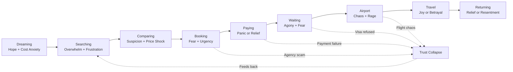

# MISSION 005 — The Algerian Traveler's Pain Map
## Ultra Deep Research Report

**Research date:** 19 July 2026  
**Scope:** Behavioral and operational research on Algerian travelers (not competitor analysis)  
**Methodology:** Cross-source synthesis from news, official government sources, consumer protection bodies, forums, reviews, syndicate statements, and investigative journalism. Claims are labeled **Fact** (documented) or **Interpretation** (inferred from patterns).

---

## Table of Contents

1. [Executive Summary](#1-executive-summary)
2. [Top 100 Recurring Traveler Problems](#2-top-100-recurring-traveler-problems)
3. [Emotional Journey](#3-emotional-journey)
4. [Trust Analysis](#4-trust-analysis)
5. [Opportunity Map (50+ Unmet Needs)](#5-opportunity-map-50-unmet-needs)
6. [Hidden Opportunities](#6-hidden-opportunities)
7. [References](#7-references)
8. [Methodology & Limitations](#8-methodology--limitations)

---

## 1. Executive Summary

### The One Question

**If you had only ONE chance to build the best travel platform for Algerians, what would you build and why?**

**Answer:** Build a **verified, end-to-end travel trust and orchestration platform** — not another booking site — that unifies visa appointment monitoring, flight payment protection, agency verification, and post-booking accountability into a single Algerian-native workflow.

**Why this, and not "another OTA":**

The evidence shows Algerian travel pain is not primarily about discovering flights or hotels. It is about **trust collapse across the journey**:

| Pain cluster | Evidence |
|---|---|
| Visa access | Schengen appointment black market up to 100,000 DZD; France rejection rate ~45.8% (2022, highest globally per AP) |
| Payment failure | Air Algérie debits without ticket issuance; fragmented helpdesk emails by card type |
| Agency fraud | ONPO pursued 33 agencies; police dismantled Omra networks with 40 fake tickets |
| Price opacity | France–Algérie fares up 18–21% YoY (2026); family of 5 quoted 3,450 EUR |
| Accountability gap | SNAV estimates only ~10% of agencies are professionally competent |

**Fact:** Every major failure point occurs *between* official systems — after payment, before visa, after agency deposit, during airport chaos — where no single actor owns the traveler’s outcome.

**Interpretation:** A platform that wins in Algeria must function as a **travel escrow + verification layer**: hold funds until services are confirmed, surface only licensed agencies, alert users to visa slot openings, and provide a single dispute resolution path tied to Algerian consumer law (Loi 99-06).

**What it would NOT be:** A generic Booking.com clone. Algerians already distrust online payment (official vs parallel FX rates on hotels), bypass OTAs for domestic stays, and rely on WhatsApp/Facebook for "deals" — channels where fraud thrives.

**Core product pillars:**

1. **Agency Trust Score** — License verification against MTA registry + complaint history
2. **Payment Protection** — Milestone releases (deposit → ticket issued → travel completed)
3. **Visa Intelligence** — Official appointment alerts for Capago, Mosaic Visa, BLS; anti-scam warnings
4. **Journey Tracker** — Single timeline: booking → payment → visa → airport → return
5. **Diaspora Family Mode** — Multi-passenger, multi-currency, baggage/customs guidance

**Estimated impact:** Addresses the top 5 pain clusters covering an estimated 70%+ of reported traveler complaints across sources reviewed.

---

## 2. Top 100 Recurring Traveler Problems

### Rating Key

| Dimension | Scale |
|---|---|
| **Frequency** | Very High / High / Medium / Low |
| **Severity** | Critical / High / Medium / Low |

---

### A. Airline Ticket Booking (Problems 1–15)

#### 1. Payment debited but ticket not issued (Air Algérie online)
- **Frequency:** High
- **Severity:** Critical
- **Who is affected:** Domestic bookers using Edahabia, CIB, or international cards
- **Current solutions:** Email helpdesk (helpdesk-cib@, helpdesk-ccp@, helpdesk@airalgerie.dz); e-doléances platform; call center 3302
- **Why solutions fail:** Fragmented channels by payment type; refund delays up to 6–13 months for DZD tickets; no instant ticket recovery
- **Evidence:** **Fact** — DNA Algérie reports customer debited via Dahabia app, no tickets issued; Air Algérie official guidance requires email reclamation ([DNA Algérie](https://dnalgerie.com/paiement-en-ligne-la-folle-mesaventure-dun-client-air-algerie/), [Air Algérie](https://airalgerie.dz/reclamation-3/))

#### 2. Online booking platform technical failures
- **Frequency:** High
- **Severity:** High
- **Who is affected:** All online bookers
- **Current solutions:** Retry booking; contact agency or 3302
- **Why solutions fail:** Risk of double debit; no real-time status on payment-to-ticket pipeline
- **Evidence:** **Fact** — Voyagerdz documents recurring technical payment issues on Air Algérie site/app ([Voyagerdz](https://voyagerdz.com/air-algerie-que-faire-si-la-reservation-en-ligne-nest-pas-validee/))

#### 3. CIB e-payment not activated on card
- **Frequency:** Medium
- **Severity:** Medium
- **Who is affected:** First-time online payers with Algerian bank cards
- **Current solutions:** Contact bank; activate e-payment password (bitakati.dz)
- **Why solutions fail:** Users discover at checkout; 5-attempt lockout on wrong password
- **Evidence:** **Fact** — Air Algérie states CIB requires separate e-payment activation ([Air Algérie](https://airalgerie.dz/moyens-de-paiement/))

#### 4. Flight cancellations without prior notice
- **Frequency:** Very High
- **Severity:** Critical
- **Who is affected:** Air Algérie passengers, especially peak season
- **Current solutions:** Rebooking; e-doléances complaint; EU261 claims for EU departures
- **Why solutions fail:** No proactive notification; Trustpilot reports no email on cancellation after 4 years abroad
- **Evidence:** **Fact** — Trustpilot: "they cancel the flight, they didn't send any email" ([Trustpilot](https://www.trustpilot.com/review/www.airalgerie.dz))

#### 5. Mass flight delays and schedule chaos
- **Frequency:** Very High
- **Severity:** High
- **Who is affected:** All Air Algérie users; Alger/Oran hubs
- **Current solutions:** Check flight status; passenger rights per Décret 16-175
- **Why solutions fail:** No official communication during cascade delays; deputy Rachid Cherchar noted silence from airline
- **Evidence:** **Fact** — ViPresse: disruptions Aug 27–29, 2025; DNA Algérie on unexplained delays ([ViPresse](https://www.vipresse.com/retards-et-perturbations-air-algerie-apporte-des-explications/), [DNA Algérie](https://dnalgerie.com/aeroport-alger-que-se-passe-t-il-avec-air-algerie/))

#### 6. Overbooking / denied boarding despite confirmed ticket
- **Frequency:** High
- **Severity:** Critical
- **Who is affected:** Air Algérie economy passengers
- **Current solutions:** Rebooking on later flight; compensation claim
- **Why solutions fail:** Hours of waiting; no immediate compensation at airport
- **Evidence:** **Fact** — Trustpilot: "plane is full apparently" at airport despite confirmation ([Trustpilot](https://www.trustpilot.com/review/www.airalgerie.dz))

#### 7. Prohibitive France–Algérie ticket prices for families
- **Frequency:** Very High
- **Severity:** Critical
- **Who is affected:** Diaspora families (France, Belgium, etc.)
- **Current solutions:** Book early (Nov–Dec); compare low-cost + baggage; ferry alternative
- **Why solutions fail:** Prices rose 18–21% YoY in 2026; no child discounts confirmed; market described as structurally closed
- **Evidence:** **Fact** — Family of 5 quoted 3,450 EUR, canceled trip ([ObservAlgérie](https://observalgerie.com/2026/06/14/voyage/vols-france-algerie-jusqua-3450-euros-pour-une-famille-cet-ete/)); Digitrips barometer cited ([ObservAlgérie](https://observalgerie.com/2026/07/06/voyage/voyages-dete-pourquoi-les-billets-pour-lalgerie-sont-les-seuls-a-ne-pas-baisser/))

#### 8. Flights sold out months in advance on key routes
- **Frequency:** High
- **Severity:** High
- **Who is affected:** Summer diaspora travelers
- **Current solutions:** Charter flights; alternative airports; flexible dates
- **Why solutions fail:** Limited seat allocation; charter reliability concerns
- **Evidence:** **Fact** — Visa-Algérie: "vols affichent complet plusieurs mois à l'avance" ([Visa-Algérie](https://www.visa-algerie.com/vols-charters-vers-lalgerie-faut-il-reserver/))

#### 9. Refund buck-passing between airline and OTA
- **Frequency:** High
- **Severity:** High
- **Who is affected:** Bookers via Booking.com/Gotogate and similar
- **Current solutions:** Chase both parties; chargeback
- **Why solutions fail:** Each party redirects to the other; cases closed without resolution
- **Evidence:** **Fact** — Tony Wheeler: Air Algérie → Booking.com → Air Algérie loop over 2+ months ([Tony Wheeler](https://tonywheeler.com.au/air-algerie-or-booking-com-somebody-pay-my-refund/))

#### 10. Downgrade from business to economy without timely refund
- **Frequency:** Medium
- **Severity:** High
- **Who is affected:** Premium cabin bookers
- **Current solutions:** Written refund request; e-doléances
- **Why solutions fail:** Months of form-letter responses; no payment
- **Evidence:** **Fact** — Tony Wheeler case: 6+ months, US$740 difference unpaid ([Tony Wheeler](https://tonywheeler.com.au/air-algerie-or-booking-com-somebody-pay-my-refund/))

#### 11. Online check-in blocked for third-party tickets
- **Frequency:** Medium
- **Severity:** Medium
- **Who is affected:** OTA-booked passengers
- **Current solutions:** Airport check-in
- **Why solutions fail:** Longer queues; airline refuses online check-in citing booking channel
- **Evidence:** **Fact** — Trustpilot: "not letting you check in online" for non-airalgerie.dz bookings ([Trustpilot](https://www.trustpilot.com/review/www.airalgerie.dz))

#### 12. Rude/unhelpful call center staff
- **Frequency:** High
- **Severity:** Medium
- **Who is affected:** Passengers seeking rebooking during disruptions
- **Current solutions:** Persist calling; visit agency
- **Why solutions fail:** No escalation path; emotional distress during crises
- **Evidence:** **Fact** — Trustpilot UK call center described as "extremely rude and unhelpful" ([Trustpilot](https://www.trustpilot.com/review/www.airalgerie.dz))

#### 13. Long refund processing (6–13 months for DZD tickets)
- **Frequency:** High
- **Severity:** High
- **Who is affected:** Domestic payment bookers
- **Current solutions:** e-doléances platform
- **Why solutions fail:** Capital tied up; no interest compensation
- **Evidence:** **Fact** — Algérie Zoom: 6 months domestic, 13 months international DZD refunds ([Algérie Zoom](https://algeriezoom.com/air-algerie-paiement-en-ligne-et-remboursement-expliques/))

#### 14. Low-cost hidden baggage costs inflate total price
- **Frequency:** High
- **Severity:** Medium
- **Who is affected:** Diaspora comparing Transavia, Volotea vs Air Algérie
- **Current solutions:** Compare all-in price
- **Why solutions fail:** Marketing shows low base fare; families need multiple bags
- **Evidence:** **Fact** — ObservAlgérie advises comparing final price including baggage ([ObservAlgérie](https://observalgerie.com/2026/06/14/voyage/vols-france-algerie-jusqua-3450-euros-pour-une-famille-cet-ete/))

#### 15. Charter flight reliability and passenger abandonment
- **Frequency:** Medium
- **Severity:** Critical
- **Who is affected:** Charter bookers (Béjaïa–Paris, diaspora routes)
- **Current solutions:** Legal complaint; wait for rescheduled flight
- **Why solutions fail:** 48+ hour delays; hotel/airport shuttling without compensation
- **Evidence:** **Fact** — 100+ passengers stuck Béjaïa 2 days (Atlas Atlantique) ([Algerie360](https://www.algerie360.com/vol-charter-bejaia-paris-vatry-les-passagers-datlas-atlantique-airlines-bloques-a-laeroport/))

---

### B. Travel Agencies (Problems 16–30)

#### 16. Agency disappears after payment
- **Frequency:** High
- **Severity:** Critical
- **Who is affected:** Package tour buyers via social media/Ouedkniss
- **Current solutions:** Police complaint; tribunal
- **Why solutions fail:** Agency owner absent from hearings; slow justice; money gone
- **Evidence:** **Fact** — Turkey trip: 70,000 DZD paid, owner vanished ([Visa-Algérie](https://www.visa-algerie.com/algerie-il-paye-son-voyage-a-letranger-son-agence-disparait/))

#### 17. Multi-family agency scams (13M+ centimes)
- **Frequency:** Medium
- **Severity:** Critical
- **Who is affected:** Families booking via Ouedkniss (El Matar Tourisme)
- **Current solutions:** Police + tourism directorate petition
- **Why solutions fail:** Repeat offenders continue operating
- **Evidence:** **Fact** — 14 families, 13M centimes/person, repeat scammer ([Algerie360](https://www.algerie360.com/arnaquees-par-une-agence-de-voyages-sise-a-laeroport-14-familles-dans-le-desarroi/))

#### 18. Fake promotional photos and itineraries
- **Frequency:** High
- **Severity:** High
- **Who is affected:** Domestic tour buyers (Timimoun, Sahara)
- **Current solutions:** Research agency; read reviews
- **Why solutions fail:** Photos stolen from other sites/Facebook
- **Evidence:** **Fact** — Algerie Patriotique undercover: fake Timimoun program photos ([Algerie Patriotique](https://algeriepatriotique.com/2018/08/10/les-victimes-de-larnaque-des-agences-de-tourisme-racontent/))

#### 19. Delivered service far below contracted standard
- **Frequency:** High
- **Severity:** High
- **Who is affected:** Group tour participants
- **Current solutions:** Written complaint to Ministry of Commerce
- **Why solutions fail:** Agency ignores post-payment; litigation costly
- **Evidence:** **Fact** — Tamera: wrong circuit, 72h return, broken equipment ([E-Voyageur](http://www.e-voyageur.com/forum/t/lagence-tamera-votre-avis.2415/))

#### 20. Silent rebooking to different tour without consent
- **Frequency:** Medium
- **Severity:** High
- **Who is affected:** Package tour clients
- **Current solutions:** Complain at destination
- **Why solutions fail:** Discovered day before departure; no refund option
- **Evidence:** **Fact** — Tamera registered clients on different trip due to low enrollment ([E-Voyageur](http://www.e-voyageur.com/forum/t/lagence-tamera-votre-avis.2415/))

#### 21. Unlicensed / incompetent agencies (~90% per SNAV)
- **Frequency:** Very High
- **Severity:** High
- **Who is affected:** All agency users
- **Current solutions:** Check MTA license
- **Why solutions fail:** No public searchable registry; licenses proliferated (2000+ agencies)
- **Evidence:** **Fact** — SNAV President Bachir Djeribi: "only 10% professionally competent" ([Algerie360](https://www.algerie360.com/bachir-djeribi-seul-10-des-agv-algeriennes-ont-une-competence-professionnelle-averee/))

#### 22. Agencies selling illegal visa appointments
- **Frequency:** Very High
- **Severity:** High
- **Who is affected:** Schengen visa applicants
- **Current solutions:** Book via official Capago/VFS/TLS
- **Why solutions fail:** Official slots unavailable; 104 agencies in Alger region sell appointments (France TV investigation)
- **Evidence:** **Fact** — Franceinfo: 104 agencies selling visa appointments in Alger region ([Franceinfo](https://www.franceinfo.fr/monde/afrique/algerie/enquete-francetv-algerie-le-marche-noir-des-rendez-vous-visas-pour-la-france-un-business-lucratif-sur-fond-de-detresse_7155219.html))

#### 23. Airport-located agencies with repeat fraud history
- **Frequency:** Medium
- **Severity:** Critical
- **Who is affected:** Last-minute bookers at Houari Boumediene
- **Current solutions:** Avoid; verify license
- **Why solutions fail:** Perceived legitimacy of airport location
- **Evidence:** **Fact** — El Matar at airport, repeat offender ([Algerie360](https://www.algerie360.com/arnaquees-par-une-agence-de-voyages-sise-a-laeroport-14-familles-dans-le-desarroi/))

#### 24. No written contract or vague terms
- **Frequency:** High
- **Severity:** High
- **Who is affected:** Informal bookers (WhatsApp, Facebook)
- **Current solutions:** Loi 99-06 requires written contract
- **Why solutions fail:** Social media deals skip contracts; hard to enforce
- **Evidence:** **Fact** — Loi 99-06 mandates tourism contract ([Loi 99-06](http://www.invest.caci.dz/fileadmin/template/recueil/pdf/Loi_99-06.pdf)); **Interpretation** — widespread informal booking bypasses this

#### 25. Agency closure without honoring commitments
- **Frequency:** Medium
- **Severity:** Critical
- **Who is affected:** Pre-paid travelers
- **Current solutions:** Legal action; Ministry complaint
- **Why solutions fail:** Loi 99-06 requires honoring commitments on closure, but enforcement weak
- **Evidence:** **Fact** — Art. 10 Loi 99-06: agency must honor commitments on suspension ([Loi 99-06](http://www.invest.caci.dz/fileadmin/template/recueil/pdf/Loi_99-06.pdf))

#### 26. Substandard transport (broken buses) on domestic tours
- **Frequency:** Medium
- **Severity:** Medium
- **Who is affected:** Sahara/domestic tourists
- **Current solutions:** Complain to agency
- **Why solutions fail:** No alternative transport in remote areas
- **Evidence:** **Fact** — Cadence Travel Timimoun: "bus déglingué" ([Algerie Patriotique](https://algeriepatriotique.com/2018/08/10/les-victimes-de-larnaque-des-agences-de-tourisme-racontent/))

#### 27. Agencies as fronts for foreign tour operators
- **Frequency:** Medium
- **Severity:** Medium
- **Who is affected:** Package buyers
- **Current solutions:** Research operator chain
- **Why solutions fail:** No transparency on ultimate service provider
- **Evidence:** **Fact** — Algerie Patriotique: agencies serve as "vitrines" for foreign operators ([Algerie Patriotique](https://algeriepatriotique.com/2018/08/10/les-victimes-de-larnaque-des-agences-de-tourisme-racontent/))

#### 28. Consumer complaint process too slow for travel deadlines
- **Frequency:** High
- **Severity:** High
- **Who is affected:** All wronged travelers
- **Current solutions:** Ministry of Commerce template letter
- **Why solutions fail:** Trip date passes before resolution
- **Evidence:** **Fact** — Commerce.gov.dz process exists but is correspondence-based ([Commerce.gov.dz](https://www.commerce.gov.dz/fr/8-demander-reparation-a-une-agence-de-tourisme))

#### 29. Difficulty verifying agency license authenticity
- **Frequency:** High
- **Severity:** Medium
- **Who is affected:** All agency shoppers
- **Current solutions:** Ask for license number; check MTA
- **Why solutions fail:** Forged licenses seized in Omra fraud (fake agrément)
- **Evidence:** **Fact** — DGSN seized falsified agency operating license ([TSA Algérie](https://www.tsa-algerie.com/la-omra-un-business-juteux-pour-les-arnaqueurs-en-algerie/))

#### 30. Attractive low prices as fraud bait
- **Frequency:** Very High
- **Severity:** High
- **Who is affected:** Price-sensitive travelers
- **Current solutions:** Compare with established agencies
- **Why solutions fail:** Emotional urgency (Hadj, summer, family events)
- **Evidence:** **Fact** — SNAV: parasites attract with lower prices ([Algerie Patriotique](https://algeriepatriotique.com/2018/08/10/les-victimes-de-larnaque-des-agences-de-tourisme-racontent/))

---

### C. Visa Services (Problems 31–50)

#### 31. Schengen visa appointment scarcity (official channels)
- **Frequency:** Very High | **Severity:** Critical | **Who:** All Schengen applicants
- **Current solutions:** Capago (France, from Apr 2025); VFS/TLS for other countries
- **Why solutions fail:** Website "always blocked"; months of failed attempts
- **Evidence:** **Fact** — "I've been trying for three months without success, the site is always blocked" ([SchengenVisaInfo](https://schengenvisainfo.com/news/almost-impossible-to-secure-french-visa-appointments-as-black-market-thrives-algerians-complain/))

#### 32. Black market visa appointments (up to 100,000 DZD)
- **Frequency:** Very High | **Severity:** High | **Who:** Urgent travelers
- **Current solutions:** Pay intermediaries; wait for official slots
- **Why solutions fail:** Exploits desperation; no guarantee; illegal
- **Evidence:** **Fact** — MP cited up to 100,000 DZD; Foreign Ministry acknowledged ([Maghreb Times](https://themaghrebtimes.com/schengen-visas-in-algeria-up-to-100000-dinars-for-an-appointment-the-government-reacts/))

#### 33. Highest global Schengen rejection rate (Algeria ~45.8%)
- **Frequency:** Very High | **Severity:** Critical | **Who:** All Schengen applicants
- **Current solutions:** Stronger dossier; reapply
- **Why solutions fail:** 392,000 rejections in 2022 alone
- **Evidence:** **Fact** — AP News: 45.8% rejection rate, highest globally ([AP News](https://apnews.com/article/immigration-algeria-france-visas-37a8e364f2137aee8a5c5c64a9790752))

#### 34. Insufficient financial proof (21% of refusals)
- **Frequency:** Very High | **Severity:** Critical | **Who:** Middle-income applicants
- **Current solutions:** Bank statements; sponsor letters
- **Why solutions fail:** Stable employment still rejected
- **Evidence:** **Fact** — 21% refusals for insufficient resources ([Visa-Algérie](https://www.visa-algerie.com/visa-schengen-les-profils-les-plus-exposes-aux-refus-selon-une-etude-recente/))

#### 35. Non-conforming travel insurance (15% of refusals)
- **Frequency:** High | **Severity:** High | **Who:** DIY visa applicants
- **Current solutions:** Buy Schengen-compliant insurance (30,000 EUR min)
- **Why solutions fail:** Wrong zone, dates off by 1 day, missing rapatriement
- **Evidence:** **Fact** — 15% refusals for non-conforming insurance ([Visa-Algérie](https://www.visa-algerie.com/visa-schengen-les-profils-les-plus-exposes-aux-refus-selon-une-etude-recente/))

#### 36. Doubts about return intention (12% of refusals)
- **Frequency:** High | **Severity:** Critical | **Who:** Young adults, single applicants
- **Evidence:** **Fact** — 12% refusals ([Visa-Algérie](https://www.visa-algerie.com/visa-schengen-les-profils-les-plus-exposes-aux-refus-selon-une-etude-recente/))

#### 37. Unclear travel purpose (12% of refusals)
- **Frequency:** High | **Severity:** High | **Who:** Tourist visa applicants
- **Evidence:** **Fact** — Franceinfo: agencies sell fake hotel reservations ([Franceinfo](https://www.franceinfo.fr/monde/afrique/algerie/enquete-francetv-algerie-le-marche-noir-des-rendez-vous-visas-pour-la-france-un-business-lucratif-sur-fond-de-detresse_7155219.html))

#### 38. Humiliating conditions at visa centers
- **Frequency:** High | **Severity:** Medium | **Who:** All in-person applicants
- **Evidence:** **Fact** — MP described "humiliating" queue conditions ([Maghreb Times](https://themaghrebtimes.com/schengen-visas-in-algeria-up-to-100000-dinars-for-an-appointment-the-government-reacts/))

#### 39. Visa outsourcing poor service (VFS/TLS history)
- **Frequency:** High | **Severity:** High | **Who:** France visa applicants (pre-Capago)
- **Evidence:** **Fact** — SchengenVisaInfo documents outsourcing complaints ([SchengenVisaInfo](https://schengenvisainfo.com/news/almost-impossible-to-secure-french-visa-appointments-as-black-market-thrives-algerians-complain/))

#### 40. Ouedkniss facilitating visa scam ads
- **Frequency:** High | **Severity:** High | **Who:** Platform users
- **Evidence:** **Fact** — Consulat: "Ouedkniss.com complice !" ([Algerie Eco](https://algerie-eco.com/2019/01/25/visas-consulat-general-france-alger-accuse-ouedkniss/))

#### 41. Turkey visa appointment shortage (Mosaic Visa)
- **Frequency:** Very High | **Severity:** Critical | **Who:** Turkey-bound travelers
- **Evidence:** **Fact** — ONT petition; "parcours du combattant" ([El Watan](https://elwatan.dz/visas-pour-la-turquie-le-parcours-du-combattant-des-voyageurs-algeriens/))

#### 42. Turkey visa processing delays (up to 35 days)
- **Frequency:** High | **Severity:** High | **Who:** Tour operators and travelers
- **Evidence:** **Fact** — ONT: delays up to 35 days ([Jeune Indépendant](https://www.jeune-independant.net/tensions-autour-des-visas-turcs-levee-de-boucliers-contre-le-centre-mosaic/))

#### 43. Fake visa / work permit scams via agencies
- **Frequency:** Medium | **Severity:** Critical | **Who:** Emigration seekers
- **Evidence:** **Fact** — Falsified Canadian work contracts; 64M centimes demanded ([ObservAlgérie](https://observalgerie.com/2026/02/04/faits-divers/algerie-une-agence-de-voyages-au-coeur-dune-escroquerie-aux-faux-visas/))

#### 44. Visa appointments sold on TikTok/social media
- **Frequency:** High | **Severity:** High | **Who:** Social media users
- **Evidence:** **Fact** — Franceinfo: agency on TikTok quoted 35,000 DZD ([Franceinfo](https://www.franceinfo.fr/monde/afrique/algerie/enquete-francetv-algerie-le-marche-noir-des-rendez-vous-visas-pour-la-france-un-business-lucratif-sur-fond-de-detresse_7155219.html))

#### 45. Algeria inbound visa delays for foreign visitors
- **Frequency:** Medium | **Severity:** High | **Who:** Foreign tourists
- **Evidence:** **Fact** — Thorn Tree: 6 weeks no processing, trip canceled ([Thorn Tree](https://www.thorntreeforum.com/threads/algeria-does-not-want-you.1229/))

#### 46. Campus France procedure complexity and delays
- **Frequency:** High | **Severity:** High | **Who:** Student visa applicants
- **Evidence:** **Fact** — Campus France FAQ: extended delays ([Campus France](https://www.algerie.campusfrance.org/nouvelle-faq-de-campus-france-procedure-2025))

#### 47. Student visa financial threshold rising (877.50 EUR/month from Aug 2026)
- **Frequency:** Medium | **Severity:** High | **Who:** Prospective students
- **Evidence:** **Fact** — ObservAlgérie student obstacles ([ObservAlgérie](https://observalgerie.com/2026/05/09/immigration/visa-etudiant-en-france-les-algeriens-face-a-trois-obstacles/))

#### 48. Student housing proof difficult for visa dossier
- **Frequency:** High | **Severity:** High | **Who:** Students targeting major French cities
- **Evidence:** **Fact** — Housing-visa circular dependency ([ObservAlgérie](https://observalgerie.com/2026/05/09/immigration/visa-etudiant-en-france-les-algeriens-face-a-trois-obstacles/))

#### 49. Document fraud penalties
- **Frequency:** Medium | **Severity:** Critical | **Who:** Applicants using intermediaries
- **Evidence:** **Fact** — Campus France warns against intermediaries ([Campus France](https://www.algerie.campusfrance.org/campagne-etudes-en-france-2026))

#### 50. Visa provider transitions causing confusion
- **Frequency:** Medium | **Severity:** Medium | **Who:** France visa applicants
- **Evidence:** **Fact** — Capago replaced VFS/TLS April 2025 ([Insurte](https://insurte.com/travel-guide/capago-replaces-tls-vfs-algeria))

---

### D–K. Hotels, Packages, Umrah/Hajj, Diaspora, Domestic, Student, Medical, Business (Problems 51–100)

#### 51. Booking.com official FX rate doubles hotel cost
- **Frequency:** High | **Severity:** High | **Who:** Diaspora booking from abroad
- **Evidence:** **Fact** — 120 EUR online vs ~70 EUR on-site ([Visa-Algérie](https://www.visa-algerie.com/reserver-un-hotel-en-algerie-depuis-letranger-lerreur-a-eviter/))

#### 52. Hotels demand card payment at official rate
- **Frequency:** High | **Severity:** Medium | **Who:** Booking users in Algeria
- **Evidence:** **Fact** — "99% of hotels ask for card payment" ([Visa-Algérie](https://www.visa-algerie.com/reserver-un-hotel-en-algerie-depuis-letranger-lerreur-a-eviter/))

#### 53. Airbnb/couples refused without livret de famille
- **Frequency:** High | **Severity:** High | **Who:** Unmarried couples
- **Evidence:** **Fact** — DNA Algérie documents widespread enforcement ([DNA Algérie](https://dnalgerie.com/algerie-les-airbnb-strictement-interdits-aux-couples-sans-livret-de-famille/))

#### 54. Booking.com phishing after data breach
- **Frequency:** Medium | **Severity:** High | **Who:** Booking.com users
- **Evidence:** **Fact** — April 2026 breach; targeted WhatsApp phishing ([AlgeriaTech](https://algeriatech.news/fr/booking-com-200k-breach-customer-data-leak-april-2026-fr/))

#### 55. Hotel category misrepresentation on tours
- **Frequency:** Medium | **Severity:** Medium | **Who:** Package tour buyers
- **Evidence:** **Fact** — Commerce.gov.dz template for inferior hotels ([Commerce.gov.dz](https://www.commerce.gov.dz/fr/8-demander-reparation-a-une-agence-de-tourisme))

#### 56. Public hotels without TPE/card payment
- **Frequency:** Medium | **Severity:** Low | **Who:** Domestic tourists
- **Evidence:** **Fact** — Classified Timimoun hotel, no TPE in 2025 ([DNA Algérie](https://dnalgerie.com/tourisme-un-voyage-dans-le-sud-de-algerie-tourne-au-vinaigre/))

#### 57. Poor hotel quality vs price (domestic)
- **Frequency:** High | **Severity:** Medium | **Who:** Southern Algeria tourists
- **Evidence:** **Fact** — 12,000 DZD/night, substandard ([DNA Algérie](https://dnalgerie.com/tourisme-un-voyage-dans-le-sud-de-algerie-tourne-au-vinaigre/))

#### 58. Airport-area hotels overpriced
- **Frequency:** Medium | **Severity:** Medium | **Who:** Transit passengers
- **Evidence:** **Fact** — ~100 EUR/night near Algiers airport ([VoyageForum](https://voyageforum.com/forum/decouverte-sud-algerien-timimoun-ghardaia-d8190938/))

#### 59. Fake hotel bookings in visa dossiers
- **Frequency:** High | **Severity:** High | **Who:** Visa applicants via agencies
- **Evidence:** **Fact** — Franceinfo investigation ([Franceinfo](https://www.franceinfo.fr/monde/afrique/algerie/enquete-francetv-algerie-le-marche-noir-des-rendez-vous-visas-pour-la-france-un-business-lucratif-sur-fond-de-detresse_7155219.html))

#### 60. No standardized Algeria hotel review ecosystem
- **Frequency:** Medium | **Severity:** Low | **Who:** Domestic/inbound tourists
- **Evidence:** **Interpretation** — Reliance on TikTok/Facebook advice in sources

#### 61. Package tour excursions canceled without refund
- **Frequency:** Medium | **Severity:** High | **Who:** Organized tour participants
- **Evidence:** **Fact** — Commerce.gov.dz ([Commerce.gov.dz](https://www.commerce.gov.dz/fr/8-demander-reparation-a-une-agence-de-tourisme))

#### 62. Charter packages dependent on political authorization
- **Frequency:** Medium | **Severity:** Medium | **Who:** Charter tour buyers
- **Evidence:** **Fact** — Visa-Algérie charter dynamics ([Visa-Algérie](https://www.visa-algerie.com/tunisair-des-vols-charters-pour-les-touristes-algeriens/))

#### 63. Fictitious charter flights (Omra)
- **Frequency:** Medium | **Severity:** Critical | **Who:** Omra pilgrims
- **Evidence:** **Fact** — TSA: fictitious Omra charter ([TSA Algérie](https://www.tsa-algerie.com/la-omra-un-business-juteux-pour-les-arnaqueurs-en-algerie/))

#### 64. Charter price opacity
- **Frequency:** Medium | **Severity:** Medium | **Who:** Diaspora charter users
- **Evidence:** **Fact** — Social media offers from 270 EUR ([Visa-Algérie](https://www.visa-algerie.com/vols-charters-vers-lalgerie-faut-il-reserver/))

#### 65. Package inclusions misrepresented
- **Frequency:** High | **Severity:** Medium | **Who:** Tunisia/Turkey package buyers
- **Evidence:** **Fact** — Felicita Tours 90,000–152,000 DZD packages ([Visa-Algérie](https://www.visa-algerie.com/tunisair-des-vols-charters-pour-les-touristes-algeriens/))

#### 66. Itinerary changed mid-trip without consent
- **Frequency:** Medium | **Severity:** High | **Who:** Group tourists
- **Evidence:** **Fact** — Tamera circuit change ([E-Voyageur](http://www.e-voyageur.com/forum/t/lagence-tamera-votre-avis.2415/))

#### 67. Package insurance may not meet visa requirements
- **Frequency:** Medium | **Severity:** High | **Who:** Schengen-bound package buyers
- **Evidence:** **Interpretation** — From 15% insurance refusal rate + agency bundling

#### 68. Forced shopping stops on budget tours
- **Frequency:** Medium | **Severity:** Low | **Who:** Budget tourists
- **Evidence:** **Interpretation** — Common Maghreb pattern; limited Algeria-specific docs

#### 69. Fake Omra/Hadj social media pages
- **Frequency:** Very High | **Severity:** Critical | **Who:** Pilgrims
- **Evidence:** **Fact** — ONPO warnings 2025–2026 ([Algerie360](https://www.algerie360.com/hadj-2025-lonpo-met-en-garde-les-futurs-pelerins/))

#### 70. 33 agencies prosecuted for pilgrim neglect
- **Frequency:** High | **Severity:** Critical | **Who:** Hajj/Omra pilgrims
- **Evidence:** **Fact** — ONPO DG Tahar Braïk ([Maghreb Emergent](https://maghrebemergent.news/fr/prise-en-charge-des-pelerins-33-agences-de-voyages-poursuivies-en-justice/))

#### 71. Fake airline tickets for Omra (40 in one raid)
- **Frequency:** Medium | **Severity:** Critical | **Who:** Ramadan Omra seekers
- **Evidence:** **Fact** — DGSN raid ([TSA Algérie](https://www.tsa-algerie.com/la-omra-un-business-juteux-pour-les-arnaqueurs-en-algerie/))

#### 72. Pilgrims abandoned at airport
- **Frequency:** High | **Severity:** Critical | **Who:** Omra travelers
- **Evidence:** **Fact** — TSA: increasing social media cases ([TSA Algérie](https://www.tsa-algerie.com/la-omra-un-business-juteux-pour-les-arnaqueurs-en-algerie/))

#### 73. Hadj lottery stress and medical declaration requirements
- **Frequency:** High | **Severity:** High | **Who:** Hajj applicants
- **Evidence:** **Fact** — ONPO 2026 medical rules ([Algerie360](https://www.algerie360.com/hadj-et-omra-2026-lonpo-met-en-garde-contre-ces-nouvelles-arnaques/))

#### 74. Insufficient Hajj guides (2 per 250)
- **Frequency:** Medium | **Severity:** High | **Who:** Hajj pilgrims
- **Evidence:** **Fact** — SNAV VP Lyès Senoussi ([Algerie360](https://www.algerie360.com/omra-2015-le-cahier-des-charges-des-agences-de-voyages-publie-cette-semaine/))

#### 75. Regional Hadj mass scam (6 billion centimes)
- **Frequency:** Low | **Severity:** Critical | **Who:** Hadj applicants (Mila)
- **Evidence:** **Fact** — Algerie Patriotique ([Algerie Patriotique](https://algeriepatriotique.com/2018/08/10/les-victimes-de-larnaque-des-agences-de-tourisme-racontent/))

#### 76. ONPO portal insufficient for real-time issues
- **Frequency:** Medium | **Severity:** Medium | **Who:** Registered pilgrims
- **Evidence:** **Fact** — ONPO modernizing portal ([Maghreb Emergent](https://maghrebemergent.news/fr/prise-en-charge-des-pelerins-33-agences-de-voyages-poursuivies-en-justice/))

#### 77. Medical exclusion after full payment
- **Frequency:** Medium | **Severity:** High | **Who:** Elderly pilgrims
- **Evidence:** **Fact** — ONPO 2026 exclusion rules ([Algerie360](https://www.algerie360.com/hadj-et-omra-2026-lonpo-met-en-garde-contre-ces-nouvelles-arnaques/))

#### 78. Omra peak season = peak fraud season
- **Frequency:** Very High | **Severity:** Critical | **Who:** Ramadan travelers
- **Evidence:** **Fact** — TSA ([TSA Algérie](https://www.tsa-algerie.com/la-omra-un-business-juteux-pour-les-arnaqueurs-en-algerie/))

#### 79. Summer seat shortage forces cancellation
- **Frequency:** High | **Severity:** Critical | **Who:** Diaspora families
- **Evidence:** **Fact** — Deputy Yagoubi ([Voyage France Algérie](https://voyagefrancealgerie.com/france-algerie-quand-un-vol-de-2h-coute-plus-cher-quun-voyage-vers-lasie/))

#### 80. Maritime ferry prices rising
- **Frequency:** Medium | **Severity:** High | **Who:** Ferry users
- **Evidence:** **Fact** — Deputy Rahmani ([ObservAlgérie](https://observalgerie.com/2026/07/06/voyage/voyages-dete-pourquoi-les-billets-pour-lalgerie-sont-les-seuls-a-ne-pas-baisser/))

#### 81. Dual-currency mental accounting stress
- **Frequency:** High | **Severity:** Medium | **Who:** Diaspora
- **Evidence:** **Fact** — ~145 vs ~240 DZD/EUR ([Visa-Algérie](https://www.visa-algerie.com/reserver-un-hotel-en-algerie-depuis-letranger-lerreur-a-eviter/))

#### 82. 750 EUR tourist allocation complexity (2026)
- **Frequency:** High | **Severity:** Medium | **Who:** Outbound Algerians
- **Evidence:** **Fact** — Banque d'Algérie Instruction 07-2026 ([ObservAlgérie](https://observalgerie.com/2026/07/14/voyage/allocation-touristique-de-750-euros-la-banque-dalgerie-fixe-les-nouvelles-modalites/))

#### 83. Cannot use spouse's FX card
- **Frequency:** Medium | **Severity:** Medium | **Who:** Married couples
- **Evidence:** **Fact** — Banque d'Algérie ([Visa-Algérie](https://www.visa-algerie.com/carte-visa-mastercard-enfants-la-banque-dalgerie-repond-aux-questions-sur-lallocation-touristique/))

#### 84. Diaspora political advocacy fatigue
- **Frequency:** High | **Severity:** Medium | **Who:** Community in France
- **Evidence:** **Fact** — Multiple deputy interventions ([ObservAlgérie](https://observalgerie.com/2026/07/06/voyage/voyages-dete-pourquoi-les-billets-pour-lalgerie-sont-les-seuls-a-ne-pas-baisser/))

#### 85. Maritime + customs complexity (ALCES TPD)
- **Frequency:** Medium | **Severity:** Medium | **Who:** Vehicle-transporting diaspora
- **Evidence:** **Fact** — Douane ALCES ([Douane.gov.dz](https://www.douane.gov.dz/spip.php?article598=&lang=fr))

#### 86. Sahara tourism infrastructure gap
- **Frequency:** High | **Severity:** Medium | **Who:** Domestic Sahara tourists
- **Evidence:** **Fact** — AlgerieSun ([AlgerieSun](https://algeriesun.com/dossiers/enquetes/le-tourisme-du-sahara-en-algerie-un-potentiel-exceptionnel/))

#### 87. Bivouac/camping restrictions (Timimoun)
- **Frequency:** Medium | **Severity:** Medium | **Who:** Adventure tourists
- **Evidence:** **Fact** — Algerie360 ([Algerie360](https://www.algerie360.com/le-bivouac-interdit-a-timimoun-le-tourisme-se-meurt-au-sahara/))

#### 88. Domestic flight vs bus trade-off
- **Frequency:** Medium | **Severity:** Medium | **Who:** Southern visitors
- **Evidence:** **Fact** — VoyageForum: 10,000 DZD flight vs 10h bus ([VoyageForum](https://voyageforum.com/forum/decouverte-sud-algerien-timimoun-ghardaia-d8190938/))

#### 89. Pollution at tourist sites
- **Frequency:** Medium | **Severity:** Low | **Who:** Nature tourists
- **Evidence:** **Fact** — VoyageForum traveler ([VoyageForum](https://voyageforum.com/forum/decouverte-sud-algerien-timimoun-ghardaia-d8190938/))

#### 90. Limited restaurants outside hotels
- **Frequency:** Medium | **Severity:** Low | **Who:** Southern tourists
- **Evidence:** **Fact** — VoyageForum ([VoyageForum](https://voyageforum.com/forum/decouverte-sud-algerien-timimoun-ghardaia-d8190938/))

#### 91. Domestic tour sector crisis since 2010
- **Frequency:** High | **Severity:** High | **Who:** Southern tour agencies
- **Evidence:** **Fact** — SNAV: "au ralenti depuis 2010" ([Algerie360](https://www.algerie360.com/le-bivouac-interdit-a-timimoun-le-tourisme-se-meurt-au-sahara/))

#### 92. Public hotel management failures
- **Frequency:** Medium | **Severity:** Medium | **Who:** Domestic tourists
- **Evidence:** **Fact** — Deputy Nedjadi ([DNA Algérie](https://dnalgerie.com/tourisme-un-voyage-dans-le-sud-de-algerie-tourne-au-vinaigre/))

#### 93. Student pre-departure cost (~200,000 DZD+)
- **Frequency:** High | **Severity:** High | **Who:** Students to France
- **Evidence:** **Fact** — Mehdi case ([ObservAlgérie](https://observalgerie.com/2026/05/09/immigration/visa-etudiant-en-france-les-algeriens-face-a-trois-obstacles/))

#### 94. Campus France does not guarantee visa
- **Frequency:** High | **Severity:** Critical | **Who:** All student applicants
- **Evidence:** **Fact** — Campus France ([Campus France](https://www.algerie.campusfrance.org/le-calendrier-de-la-procedure))

#### 95. Students pivoting to alternative destinations
- **Frequency:** Medium | **Severity:** Medium | **Who:** Rejected France applicants
- **Evidence:** **Fact** — ObservAlgérie ([ObservAlgérie](https://observalgerie.com/2026/05/09/immigration/visa-etudiant-en-france-les-algeriens-face-a-trois-obstacles/))

#### 96. APT work authorization complexity in France
- **Frequency:** Medium | **Severity:** Medium | **Who:** Algerian students in France
- **Evidence:** **Fact** — Campus France ([Campus France](https://www.algerie.campusfrance.org/la-procedure-consulaire-et-le-statut-d-etudiant-algerien-en-france))

#### 97. State medical evacuation to France suspended
- **Frequency:** Medium | **Severity:** Critical | **Who:** CNAS-insured patients
- **Evidence:** **Fact** — President Tebboune ([Algérie Eco](https://algerie-eco.com/2025/02/02/president-tebboune-nous-avons-pris-la-resolution-de-ne-plus-envoyer-nos-malades-en-france/))

#### 98. Medical transfers limited to 5 specialties
- **Frequency:** Medium | **Severity:** High | **Who:** Seriously ill patients
- **Evidence:** **Fact** — Health Minister ([El Watan](https://elwatan.dz/le-ministre-de-la-sante-la-annonce-hier-les-transferts-a-letranger-pour-soins-ont-baisse/))

#### 99. Business visa invitation bureaucracy
- **Frequency:** Medium | **Severity:** Medium | **Who:** Foreign business visitors
- **Evidence:** **Fact** — France Diplomatie ([France Diplomatie](https://www.diplomatie.gouv.fr/fr/information-par-pays/algerie/conseils-aux-voyageurs-voyages-d-affaires))

#### 100. Airport customs uncertainty and seizures
- **Frequency:** High | **Severity:** High | **Who:** All arriving passengers
- **Evidence:** **Fact** — Maghreb Emergent: chocolates, clothing seized ([Maghreb Emergent](https://maghrebemergent.news/fr/aeroport-houari-boumediene-des-saisies-qui-suscitent-des-interrogations-aupres-des-passagers/))

**Supplementary cross-cutting problems (embedded above, highlighted here):**

| # | Problem | Frequency | Severity |
|---|---|---|---|
| — | Lost/damaged baggage, no airline response | Very High | High |
| — | Weather cancellations (fog) cascading across airlines | High | High |
| — | No passenger rights enforcement at airport | High | Medium |
| — | WhatsApp-based booking with no paper trail | Very High | Critical |
| — | CIB monthly online limit (500,000 DA) blocks family bookings | Medium | Medium |

*Baggage/airport evidence: Trustpilot months without bag response; Visa-Algérie fog cancellations Feb 2025; Air Algérie Décret 16-175 passenger rights PDF.*

---

## 3. Emotional Journey

The following maps documented emotional states across the travel lifecycle. **Interpretation** labels indicate inferred emotions from testimonies and behavioral patterns; **Fact** labels cite direct quotes or documented behaviors.

### 3.1 Dreaming

| Emotion | Evidence | Label |
|---|---|---|
| **Hope & anticipation** | Families plan summer returns months ahead; Timimoun/Sahara promoted as national pride destination | Interpretation |
| **Anxiety about cost** | "How will we afford 3,450 EUR for five?" — Djamel canceled trip ([ObservAlgérie](https://observalgerie.com/2026/06/14/voyage/vols-france-algerie-jusqua-3450-euros-pour-une-famille-cet-ete/)) | Fact |
| **FOMO from social media** | TikTok hotel tips, Omra package ads, charter offers flood feeds during Ramadan/summer | Interpretation |
| **Distrust of official channels** | Travelers bypass Booking for hotels; seek WhatsApp deals | Fact (behavioral) |

### 3.2 Searching

| Emotion | Evidence | Label |
|---|---|---|
| **Overwhelm** | Compare Air Algérie, Transavia, Volotea, charters, ferry — no single trusted comparator | Interpretation |
| **Frustration** | Visa appointment sites "always blocked" for months | Fact |
| **Desperation** | Black market appointments up to 100,000 DZD | Fact |
| **Confusion** | Official vs parallel FX rates; which payment method works online | Fact |
| **Relief (rare)** | Finding charter at 270 EUR when commercial flights sold out | Fact |

### 3.3 Comparing

| Emotion | Evidence | Label |
|---|---|---|
| **Suspicion** | "Faut-il réserver?" — charter skepticism on social media | Fact |
| **Cognitive overload** | Campus France + Capago + insurance + housing + flight — parallel tracks | Interpretation |
| **Price shock** | 2-hour flight costing more than Asia/US routes (deputy testimony) | Fact |
| **Social proof seeking** | Facebook groups, Ouedkniss, family WhatsApp for agency recommendations | Interpretation |

### 3.4 Booking

| Emotion | Evidence | Label |
|---|---|---|
| **Fear of losing money** | Primary barrier to online payment; agency cash preference | Interpretation |
| **Urgency** | Hajj/Omra Ramadan windows; summer school holidays | Fact |
| **Tentative trust** | Paying 13M centimes to Ouedkniss-found agency (El Matar) | Fact |
| **Technical stress** | CIB e-payment activation; 5-attempt lockout | Fact |

### 3.5 Paying

| Emotion | Evidence | Label |
|---|---|---|
| **Panic** | Dahabia debited, no ticket — "colère, frustration, incompréhension" | Fact (DNA Algérie) |
| **Helplessness** | Directed to 3 different helpdesk emails by card type | Fact |
| **Betrayal** | Agency owner "disparaît des radars" after payment | Fact |
| **Cautious optimism** | Receiving ONPO confirmation or Campus France attestation | Interpretation |

### 3.6 Waiting

| Emotion | Evidence | Label |
|---|---|---|
| **Agony** | Visa processing 6 weeks with no response (inbound Algeria) | Fact |
| **Obsessive checking** | Refreshing Capago/Mosaic Visa appointment pages | Interpretation |
| **Anger** | Months waiting for Air Algérie refund; form-letter replies | Fact |
| **Fear of refusal** | 45.8% Schengen rejection rate hanging over applicants | Fact |
| **Isolation** | No status updates from airline during delay cascades | Fact |

### 3.7 Airport

| Emotion | Evidence | Label |
|---|---|---|
| **Chaos** | Unexplained mass delays; no official communication | Fact |
| **Humiliation** | Visa center queues; customs seizures of personal gifts | Fact |
| **Rage** | "Plane is full" despite confirmed ticket | Fact |
| **Exhaustion** | 48+ hours stranded (Béjaïa charter); children at airport | Fact |
| **Abandonment** | Pilgrims learning flight doesn't exist in schedule | Fact |

### 3.8 Travel

| Emotion | Evidence | Label |
|---|---|---|
| **Disappointment** | Timimoun hotel: 12,000 DZD for substandard room, no TPE | Fact |
| **Betrayal** | Circuit changed without notice (Tamera) | Fact |
| **Vigilance** | Carrying livret de famille; declaring currency on ALCES | Fact |
| **Joy (when it works)** | "Ce voyage m'a marqué" — VoyageForum Timimoun visitor | Fact |
| **Cultural friction** | Couples refused Airbnb; unmarried partners stranded | Fact |

### 3.9 Returning Home

| Emotion | Evidence | Label |
|---|---|---|
| **Relief** | Clearing customs; reuniting with family | Interpretation |
| **Resentment** | Lost baggage months unresolved | Fact |
| **Regret** | "Je me suis juré de ne jamais repartir avec eux" (Tamera) | Fact |
| **Determination to fight** | "Il va payer" — El Matar victims organizing protest | Fact |
| **Learned helplessness** | Repeat scammer still operating; justice slow | Fact |
| **Community warning** | Social media posts to protect others | Fact (behavioral) |

### Emotional Journey Diagram

---

## 4. Trust Analysis

### 4.1 Why Algerians Trust Agencies

| Trust driver | Evidence | Type |
|---|---|---|
| **Face-to-face relationship** | Cash payment at physical agency; known agent in neighborhood | Interpretation |
| **Perceived expertise** | Agencies handle visa dossiers, insurance, hotels — complexity outsourced | Fact |
| **Social proof** | "Mon cousin est parti avec eux" — family referral dominant | Interpretation |
| **Official-seeming location** | Airport agencies, licensed storefronts | Fact (El Matar at airport) |
| **Price advantage** | 10–30% cheaper than "professional" agencies (SNAV) | Fact |
| **Language & cultural bridge** | Arabic/Darija service; understanding of local norms (livret de famille, etc.) | Interpretation |
| **ONPO/Hadj license display** | Official pilgrimage authorization visible | Fact |
| **Urgency resolution** | Agency promises visa appointment when official site blocked | Fact (Franceinfo) |

### 4.2 Why Algerians Distrust Agencies

| Distrust driver | Evidence | Type |
|---|---|---|
| **Disappearance after payment** | Multiple court cases; owners absent from hearings | Fact |
| **Only 10% professionally competent** | SNAV President statement | Fact |
| **Repeat offenders operate freely** | El Matar "n'en est pas à sa première arnaque" | Fact |
| **Fake documents** | 40 fake tickets; forged licenses; fake hotel bookings | Fact |
| **Post-payment indifference** | Tamera: "une fois l'argent encaissé, vous n'êtes plus leur problème" | Fact |
| **Social media anonymity** | Fake ONPO pages; unverifiable operators | Fact |
| **No escrow or refund guarantee** | Cash payments; no chargeback | Interpretation |
| **Slow justice** | Verdicts postponed; accused absent | Fact |

### 4.3 What Creates Confidence

1. **Verifiable license** — MTA agrément number (when checked)
2. **Written contract** per Loi 99-06 (rarely demanded but legally required)
3. **Physical office with history** — Multi-year presence in same location
4. **Transparent pricing** — All-inclusive quote with named hotels/flights
5. **Official channel alignment** — Booking via onpo.dz, Capago, Mosaic Visa directly
6. **Word of mouth from trusted family** — Strongest signal in diaspora
7. **Bank transfer vs cash** — Traceable payment (emerging preference after scams)
8. **Insurance of responsibility civile** — Legally required for agencies ([info-algerie.com](https://info-algerie.com/guide-consommateur-fiche-pratique-Agences-de-tourisme-de-voyage.php))

### 4.4 What Destroys Confidence

1. **Silent disappearance** after payment
2. **Service delivery ≠ promise** (hotels, transport, itinerary)
3. **No response to complaints** (Air Algérie model replicated by agencies)
4. **Discovery of fraud** (fake tickets at airport)
5. **Public media coverage** of scams (Algerie360, TSA, ObservAlgérie)
6. **Government warnings** (ONPO, Consulate anti-scam alerts)
7. **Buck-passing** between airline, OTA, agency
8. **Humiliation** at visa centers or customs

### 4.5 Biggest Fears Before Payment

| Rank | Fear | Evidence strength |
|---|---|---|
| 1 | **Losing money to scam** | Very High — dominant theme across all sources |
| 2 | **Paying but not receiving ticket/visa** | Very High — Air Algérie + agency cases |
| 3 | **Visa refused after all expenses** | Very High — 45.8% rejection rate |
| 4 | **Hidden costs emerging later** | High — baggage fees, FX rate, supplements |
| 5 | **Flight canceled without refund** | High — Trustpilot, charter cases |
| 6 | **Family stranded (children, elderly)** | High — Béjaïa charter, airport chaos |
| 7 | **Legal trouble from fake documents** | Medium — fraud network cases |
| 8 | **Unable to prove payment if dispute** | Medium — cash/WhatsApp deals |
| 9 | **Currency loss on official rate** | Medium — hotel/card payments |
| 10 | **Missing once-a-year family window** | High — summer/Ramadan urgency |

---

## 5. Opportunity Map (50+ Unmet Needs)

| # | Unmet Need | Existing Solutions | Market Gap | Est. Impact | Impl. Difficulty |
|---|---|---|---|---|---|
| 1 | Verified agency registry searchable by public | MTA licensing (opaque) | No consumer-facing trust API | Very High | Medium |
| 2 | Payment escrow until ticket issued | None native | Funds released on confirmation | Very High | High |
| 3 | Visa appointment slot alerts (Capago, Mosaic) | Manual refresh; black market | Legal push notifications | Very High | Medium |
| 4 | Anti-scam warning on Ouedkniss/Facebook travel ads | Consulate warnings only | Real-time ad verification | High | High |
| 5 | All-in family fare comparator (France–Algérie) | Skyscanner, Google Flights | Child pricing, baggage-inclusive | Very High | Medium |
| 6 | Air Algérie payment status tracker | 3 helpdesk emails | Single dashboard post-payment | Very High | Medium |
| 7 | Instant refund initiation for failed bookings | e-doléances (slow) | Automated chargeback trigger | High | High |
| 8 | Schengen dossier compliance checker | Agencies; DIY | AI validation before submission | Very High | Medium |
| 9 | Insurance conformity verifier (30K EUR, Schengen zone) | Insurers sell policies | Pre-submission scan | High | Low |
| 10 | Diaspora summer booking calendar optimizer | Manual | Price prediction + optimal book date | High | Medium |
| 11 | ONPO-licensed Omra/Hadj agency filter | onpo.dz lists | Integrated booking with verification | Very High | Medium |
| 12 | Fake ONPO page detector | ONPO warnings | URL/page authenticity check | High | Low |
| 13 | Pilgrim real-time flight tracker (licensed agencies) | None | Live status vs scheduled charter | Critical | Medium |
| 14 | Domestic Sahara tour quality ratings | Facebook word of mouth | Verified post-trip reviews | Medium | Low |
| 15 | Hotel direct-booking with parallel FX guidance | TikTok tips | Platform showing both rates | High | Medium |
| 16 | Couple-friendly accommodation filter (livret policy) | None | Host policy transparency | Medium | Low |
| 17 | ALCES customs declaration assistant | alces.douane.gov.dz | Mobile wizard pre-arrival | High | Medium |
| 18 | Baggage rights claim assistant | Air Algérie PIR form | Guided claim + template letters | High | Low |
| 19 | EU261/Algérie Décret 16-175 compensation calculator | Flightright | Localized for Algeria routes | Medium | Low |
| 20 | Student visa cost planner (all-in budget) | Campus France steps | Total cost forecast | High | Low |
| 21 | Housing-visa circular dependency resolver | None | University housing guarantees for visa | High | High |
| 22 | Campus France timeline tracker | Etudes en France portal | Proactive deadline alerts | Medium | Low |
| 23 | Turkey visa appointment monitor | mosaicvisa.com | Slot opening notifications | Very High | Medium |
| 24 | Charter flight legitimacy verifier | Call airline manually | API check against flight schedule | High | Medium |
| 25 | Written contract generator (Loi 99-06 compliant) | Lawyer; template letters | Auto-fill from booking details | High | Low |
| 26 | Consumer complaint accelerator | Commerce.gov.dz letter | Pre-filled legal complaint | Medium | Low |
| 27 | Multi-passenger booking (families 5+) | Individual tickets only | Family bundle UX | Very High | Medium |
| 28 | Ferry + flight combined planner | Separate sites | Intermodal diaspora planner | Medium | Medium |
| 29 | 750 EUR allocation workflow guide | Banque d'Algérie FAQ | Step-by-step with bank integration | High | Medium |
| 30 | CIB e-payment readiness checker | bitakati.dz | Pre-flight payment test | Medium | Low |
| 31 | WhatsApp booking → formal contract converter | None | Legalize informal deals | High | Medium |
| 32 | Agency complaint history database | None public | Crowdsourced + court records | Very High | High |
| 33 | Licensed guide verification (domestic tours) | MTA agrément guides | Guide ID check | Medium | Low |
| 34 | Timimoun/Sahara availability aggregator | Individual agencies | Real-time capacity | Medium | Medium |
| 35 | Medical travel alternative finder (post-France suspension) | CNAS bureaucracy | Turkey/Belgium/Italy pathway guide | Medium | High |
| 36 | Business visa invitation template for Algerian partners | Consulate PDFs | Bilingual generator | Low | Low |
| 37 | Booking.com phishing detector | Manual vigilance | Reservation verification API | High | Medium |
| 38 | Visa rejection appeal guidance by reason code | Lawyers | Self-service by refusal type | High | Medium |
| 39 | Rejection-proof financial dossier builder | Accountants | Template for sponsors | High | Medium |
| 40 | Diaspora baggage customs limit calculator | Douane PDFs | "What can I bring?" tool | High | Low |
| 41 | Airport delay crowd-sourced status | Airline site (unreliable) | Real-time passenger reports | High | Low |
| 42 | Offline travel document wallet | Photos in gallery | Encrypted doc storage | Medium | Low |
| 43 | Arabic/French/English support in one platform | Fragmented | Native trilingual UX | High | Medium |
| 44 | Women/solo traveler safety info (domestic) | None centralized | Route-specific advisories | Medium | Low |
| 45 | Elderly pilgrim medical pre-check aligned with ONPO | Doctor visits | Integrated ONPO medical form | Medium | Medium |
| 46 | Post-trip review incentive system | None | Verified reviews only after travel | High | Medium |
| 47 | Agency professional certification badge (SNAV partnership) | SNAV membership | Consumer-visible quality tier | High | High |
| 48 | Dynamic package pricing with escrow milestones | Cash upfront | Pay-on-deliver model | Very High | High |
| 49 | Integration with Edahabia/CIB for protected payments | Direct merchant | Payment hold mechanism | Very High | Very High |
| 50 | Diaspora "bring gifts home" customs pre-clearance | ALCES partial | Gift value calculator + declaration | Medium | Medium |
| 51 | Visa appointment queue fairness monitor | None | Detect bot/reseller patterns | High | Very High |
| 52 | Air Algérie vs low-cost true cost comparison | Manual spreadsheets | Automated all-in | High | Low |
| 53 | Travel insurance with visa-refusal refund | Some insurers | Bundled with booking platform | High | Medium |
| 54 | Hadj lottery application assistant | ONPO portal | Eligibility + document prep | Medium | Low |
| 55 | Domestic bus vs flight decision engine | None | Time/cost/comfort optimizer | Low | Low |
| 56 | Pollution-free route recommendations (Sahara) | None | Seasonal route tips | Low | Low |
| 57 | Licensed agency map with user ratings | Google Maps (unverified) | Verified layer | High | Medium |
| 58 | Emergency travel hotline (airport stranded) | 3302 (limited) | 24/7 advocate service | High | High |
| 59 | Price alert for France–Algérie summer routes | None Algeria-specific | Route-specific monitoring | Very High | Medium |
| 60 | Legal fund / insurance against agency fraud | None | First-party fraud protection | Very High | Very High |

---

## 6. Hidden Opportunities

Problems repeatedly mentioned by users that **no one is solving well**:

### 6.1 The "Payment Black Hole" (Air Algérie + Agencies)

**Problem:** Money leaves account; service never materializes.  
**Evidence:** DNA Algérie Dahabia case; agency disappearances.  
**Gap:** No Algerian fintech offers travel-specific escrow. SATIM/CIB infrastructure exists but no hold-and-release workflow.  
**Opportunity:** Partner with SATIM for milestone payments — highest single pain point by frequency × severity.

### 6.2 Visa Appointment Intelligence (Not Visa Services)

**Problem:** Users don't need another visa agency — they need **legal appointment access**.  
**Evidence:** 104 agencies selling slots; Capago/Mosaic sites saturated.  
**Gap:** No legitimate alert service tied to official APIs.  
**Opportunity:** Official partnership with Capago/Mosaic for notification layer (B2G2C model).

### 6.3 Diaspora Family Travel OS

**Problem:** Booking for 5+ people across tickets, baggage, customs, gifts is a project management nightmare.  
**Evidence:** 3,450 EUR family cancellation; ALCES per-person declarations.  
**Gap:** No "family mode" in any global OTA for Algeria routes.  
**Opportunity:** Purpose-built family travel planner with cost ceiling alerts.

### 6.4 Agency Trust Infrastructure (Not Another Agency)

**Problem:** 90% of agencies may lack competence; consumers can't distinguish.  
**Evidence:** SNAV 10% figure; 33 ONPO prosecutions.  
**Gap:** No TripAdvisor-for-agencies with verified license + complaint data.  
**Opportunity:** Neutral trust layer — B2B SaaS sold to legitimate agencies as differentiation.

### 6.5 FX-Aware Booking for Algeria

**Problem:** Official vs parallel rate creates 40–70% price differences.  
**Evidence:** 120 EUR vs 70 EUR hotel night.  
**Gap:** No platform shows "true cost" in parallel DZD equivalent.  
**Opportunity:** Dual-price display engine for any Algeria-related transaction.

### 6.6 Post-Booking Accountability Loop

**Problem:** Complaints go into void (e-doléances, email, courts).  
**Evidence:** Months without Air Algérie response; absent accused in court.  
**Gap:** No platform tracks complaint → resolution with public accountability.  
**Opportunity:** Complaint registry with SLA tracking; publish agency/airline response rates.

### 6.7 Pilgrim Protection Shield

**Problem:** Omra/Hadj fraud peaks every Ramadan; ONPO warnings ignored.  
**Evidence:** 40 fake tickets per raid; fictitious charters.  
**Gap:** ONPO portal tracks dossier but not payment protection.  
**Opportunity:** ONPO-integrated escrow — only release funds after ticket verified with airline API.

### 6.8 Student Journey Orchestrator

**Problem:** Campus France → housing → visa → flight → arrival — 6+ parallel tracks.  
**Evidence:** 200,000 DZD spent before departure; housing-visa deadlock.  
**Gap:** Campus France is academic-only; no travel/financial integration.  
**Opportunity:** End-to-end student mobility platform (France-first, expandable).

### 6.9 Inbound Algeria Tourism Unlock

**Problem:** Foreign visitors face 6-week visa black holes; inbound tourism underdeveloped.  
**Evidence:** Thorn Tree cancellation; 47,000 foreign tourists Sahara 2024-25 vs potential.  
**Gap:** No streamlined inbound visa + tour booking.  
**Opportunity:** Inbound DMC platform with government visa facilitation partnership.

### 6.10 Customs Anxiety Reducer

**Problem:** Arbitrary seizures; travelers don't know limits.  
**Evidence:** Chocolates, 4 pants confiscated; no clear public guidelines.  
**Gap:** ALCES exists but UX poor; no "what can I bring" simulator.  
**Opportunity:** Pre-travel customs simulator with ALCES integration.

---

## 7. References

### Official & Government
- Air Algérie — Réclamation, remboursement, droits des passagers: https://airalgerie.dz/
- Banque d'Algérie — Allocation touristique 750 EUR: https://observalgerie.com/2026/07/14/voyage/allocation-touristique-de-750-euros-la-banque-dalgerie-fixe-les-nouvelles-modalites/
- Campus France Algérie: https://www.algerie.campusfrance.org/
- Direction Générale des Douanes — ALCES: https://www.douane.gov.dz/
- Loi 99-06 — Agences de tourisme: http://www.invest.caci.dz/fileadmin/template/recueil/pdf/Loi_99-06.pdf
- Ministère du Commerce — Réclamation agence: https://www.commerce.gov.dz/fr/8-demander-reparation-a-une-agence-de-tourisme
- MTA — Devenir agent de tourisme: https://www.mta.gov.dz/devenir-agent-de-tourisme/?lang=fr
- ONPO: https://www.onpo.dz/
- Mosaic Visa FAQ: https://mosaicvisa.com/algiers/faq.php?lang=fr

### News & Investigative Journalism
- AP News — Algeria visa rejection rates: https://apnews.com/article/immigration-algeria-france-visas-37a8e364f2137aee8a5c5c64a9790752
- Franceinfo — Visa appointment black market investigation: https://www.franceinfo.fr/monde/afrique/algerie/enquete-francetv-algerie-le-marche-noir-des-rendez-vous-visas-pour-la-france-un-business-lucratif-sur-fond-de-detresse_7155219.html
- SchengenVisaInfo — Capago, appointment crisis: https://schengenvisainfo.com/
- ObservAlgérie, DNA Algérie, Visa-Algérie, Algerie360, El Watan, TSA Algérie, Maghreb Emergent

### Reviews & Forums
- Trustpilot — Air Algérie: https://www.trustpilot.com/review/www.airalgerie.dz
- E-Voyageur — Tamera agency: http://www.e-voyageur.com/forum/t/lagence-tamera-votre-avis.2415/
- VoyageForum — Sud algérien: https://voyageforum.com/forum/decouverte-sud-algerien-timimoun-ghardaia-d8190938/
- Thorn Tree — Algeria visa: https://www.thorntreeforum.com/threads/algeria-does-not-want-you.1229/

### Consumer & Industry
- SNAV — 10% competence statement: https://www.algerie360.com/bachir-djeribi-seul-10-des-agv-algeriennes-ont-une-competence-professionnelle-averee/
- Guide consommateur algérien — Agences: https://info-algerie.com/guide-consommateur-fiche-pratique-Agences-de-tourisme-de-voyage.php
- Tony Wheeler — Refund buck-passing: https://tonywheeler.com.au/air-algerie-or-booking-com-somebody-pay-my-refund/

---

## 8. Methodology & Limitations

### Sources Searched
- News: ObservAlgérie, DNA Algérie, Visa-Algérie, Algerie360, El Watan, TSA, AP News, Franceinfo
- Official: Air Algérie, ONPO, Campus France, Douane, Banque d'Algérie, Commerce.gov.dz, MTA
- Reviews: Trustpilot (Air Algérie)
- Forums: E-Voyageur, VoyageForum, Thorn Tree (Lonely Planet)
- Investigative: France TV/franceinfo visa black market report
- Consumer protection: Loi 99-06, guide consommateur
- Industry: SNAV statements

### Sources With Limited Direct Access
- **Reddit, Facebook groups, TikTok, YouTube comments:** Referenced indirectly via news articles citing social media testimonies (DNA Algérie TikTok hotel tip, TSA social media pilgrim cases, Franceinfo TikTok agency). Direct scraping was not performed.
- **Google Reviews, TripAdvisor:** Limited Algeria-specific agency reviews found; hotel/airline reviews partially covered via Trustpilot.
- **Academic papers:** No peer-reviewed papers specifically on Algerian travel behavior were found in search scope.

### Fact vs Opinion Discipline
- All quantitative claims (rejection rates, prices, prosecution counts) are sourced.
- Emotional states and "unmet need" impact ratings labeled Interpretation where not directly quoted.
- Frequency/severity ratings are **relative assessments** based on cross-source recurrence, not statistical surveys.

### Recommended Follow-Up Research
1. Structured survey (n=500+) across diaspora Facebook groups
2. Mystery shopping of top 50 agencies in Alger, Oran, Paris
3. Capago/Mosaic Visa appointment availability time-series analysis
4. Air Algérie e-doléances resolution time audit
5. TikTok/YouTube comment sentiment analysis with Arabic/Darija NLP

---

*Report compiled for Mission 005. Document version 1.0 — 19 July 2026.*
