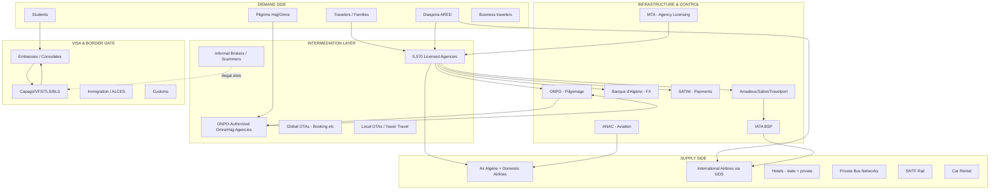
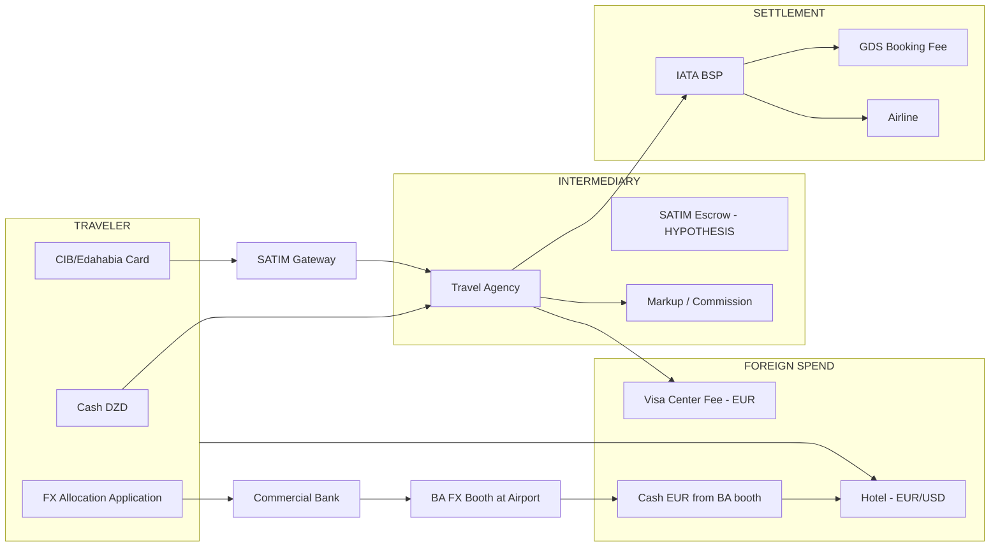
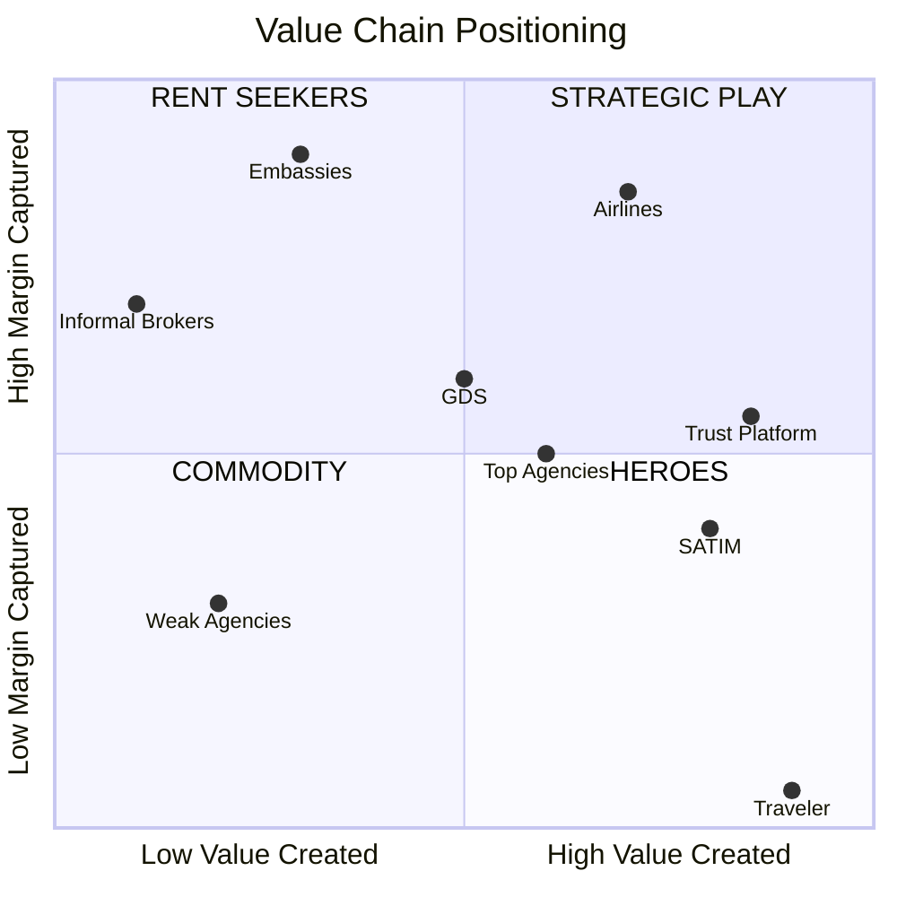
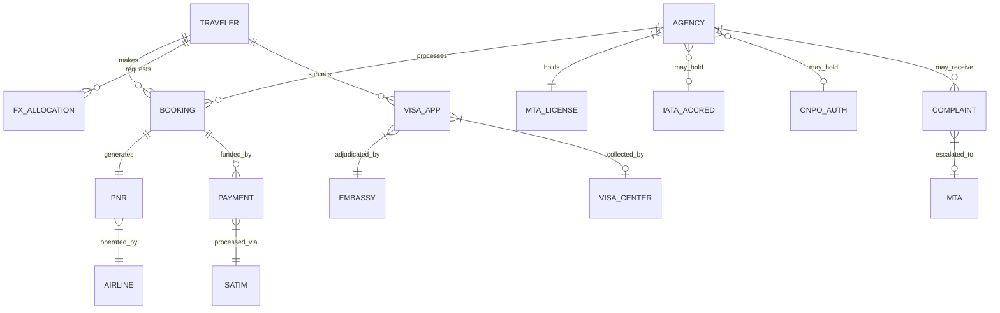
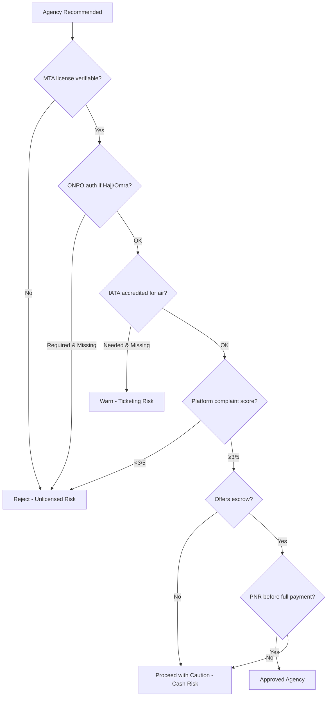

# MISSION 007: The Algerian Travel Industry Operating System
## Strategic Intelligence Report — Ultra Deep Research v3

**Classification:** Strategic Intelligence  
**Version:** 1.0  
**Date:** 19 July 2026  
**Audience:** Founders building multi-billion-dollar travel technology companies  
**Methodology:** Evidence-first reverse engineering. All major claims labeled **FACT**, **INTERPRETATION**, or **HYPOTHESIS**. Evidence strength rated A (primary/official) → D (anecdotal).

---

## Executive Summary

**INTERPRETATION:** Algeria's travel industry is not a market — it is a **regulated trust network** where value is created by physical intermediaries, state-controlled foreign exchange, embassy gatekeepers, and a national airline that owns both supply and distribution chokepoints. A travel technology company that treats Algeria as "Booking.com with SATIM" will fail. The winning architecture is **trust infrastructure + orchestration**: verified agencies, escrow payments, visa intelligence, journey tracking, and complaint resolution — with travel inventory as the outcome, not the product.

### The Five Laws of Algerian Travel Economics

| # | Law | Evidence |
|---|-----|----------|
| 1 | **Trust is the product; travel is the outcome** | 56.7% book via physical agencies despite 84.2% researching online (Madouche & Zair 2018, cited in Mission 006) |
| 2 | **FX is a hidden tax on every transaction** | Official vs parallel EUR/DZD spread ~40–60% (Visa-Algerie 2025; Travel Currency Guide 2026) |
| 3 | **Embassies own the demand funnel for international travel** | Algeria: 185,101 Schengen refusals in 2024 — highest globally (EC/Intelpoint 2024) |
| 4 | **Air Algérie owns domestic and diaspora air supply** | Amadeus Altea PSS; 6 GDS; BSP; ~6.5M passengers (Aviation Week 2022) |
| 5 | **5,570 licensed agencies ≠ 5,570 competent operators** | SNAV president: ~10% professional competence (Algerie360 interview; date pre-2020) |

### Strategic Recommendation

Build **Algeria's Travel Trust Layer** — a vertically integrated platform combining:
1. ONPO/MTA-verified agency registry (public API)
2. SATIM escrow with milestone release (ticket issued → visa obtained → departure)
3. Visa slot intelligence + dossier compliance AI
4. Community scam registry + complaint arbitration
5. Family-scale journey orchestration (not individual booking)

**Moat:** Regulatory data + payment escrow + dispute history + diaspora network effects.  
**Not moat:** Flight search, hotel aggregation, or copying Booking.com UX.

---

## Evidence Strength Key

| Rating | Meaning |
|--------|---------|
| **A** | Official government source, IATA/EC data, airline documentation |
| **B** | Reputable journalism, industry reports, academic research |
| **C** | Industry interviews, trade association statements |
| **D** | Social media, anecdotal, unverified |

---

# SECTION 1: INDUSTRY ARCHITECTURE

## 1.1 Ecosystem Map



## 1.2 Stakeholder Registry

### 1.2.1 Demand Side

| Stakeholder | Role | Power (1-10) | Dependencies | Revenue | Risks | Weaknesses | Influence | Digital Maturity |
|-------------|------|-------------|--------------|---------|-------|------------|-----------|------------------|
| **Domestic travelers** | Leisure, family, medical, business | 3 | Agencies, Air Algérie, FX allocation, visas | N/A (payers) | Scams, FX loss, visa denial | Low individual bargaining power | Low unless organized | Medium (social/WhatsApp) |
| **Diaspora (ARED)** | Summer family visits, remittance-linked travel | 7 | Foreign passports, foreign banks, family networks in Algeria | N/A | Dual pricing, FX arbitrage rules | Split loyalties (origin vs destination) | High via remittances + social media | High |
| **Students** | Campus France, study visas | 4 | Campus France, embassies, agencies for logistics | N/A | Visa rejection, housing scams | Young, price-sensitive | Medium | High |
| **Hajj/Omra pilgrims** | Religious travel (state-regulated) | 5 | ONPO, authorized agencies, Saudi quotas | N/A | Agency fraud, quota limits | Captive to ONPO calendar | High during seasons | Low-Medium |
| **Families (decision unit)** | Collective decision-making unit | 8 | Elders, WhatsApp groups, trusted agencies | N/A | Social shame of bad trip | Slow decisions, high trust bar | Very high | Low-Medium |

**FACT (B):** 3.548M tourists in 2024: 2.454M foreign + 1.093M diaspora (ONAT DG Saliha Nacer Bey, Algerie Eco April 2025).  
**FACT (A):** Tourist FX allowance: €750/adult, €300/minor (12–18), once/year, min 7-day stay (BA Instruction 05-2025, July 2025).

### 1.2.2 Intermediation Layer

| Stakeholder | Role | Power | Dependencies | Revenue | Risks | Weaknesses | Influence | Digital |
|-------------|------|-------|--------------|---------|-------|------------|-----------|---------|
| **Licensed travel agencies (AGV)** | Package assembly, ticketing, visa support, Hajj/Omra | 7 | MTA license, IATA/BSP (optional), GDS, Air Algérie allotments | Commissions 5–15%; service fees; FX spread; markups | License revocation, airline debit memos, fraud prosecution | ~90% low competence per SNAV (C, dated); fragmented | High locally | Low |
| **ONPO-authorized agencies** | Hajj/Omra packages only | 8 | ONPO authorization, Saudi partners, bawabetelomra.dz | Package margins; volume bonuses | ONPO sanctions; Saudi regulation changes | Seasonal cash flow | Very high in pilgrimage | Medium (portals exist) |
| **IATA-accredited agencies** | International BSP ticketing | 6 | IATA accreditation, bank guarantee, GDS contracts | BSP commissions; override deals | BSP chargebacks; airline debit memos | Limited number; high barriers | Medium | Medium |
| **Informal brokers** | Illegal visa slots, fake documents, "guaranteed" visas | 4 | Embassy system gaps, desperation | Slot resale €200–2000+ (D) | Criminal prosecution; consular blacklists | No legal standing; reputation risk | Destructive | High (Facebook/Telegram) |
| **Global OTAs (Booking.com)** | Hotel discovery/booking | 5 | Hotel partnerships, international payments | Commission 15–25% | FX regulatory risk; cash economy bypass | Cannot process SATIM; FX trap for Algeria hotels | Medium for inbound | High |
| **Yassir** | Super app; travel vertical in development | 6 | Ride/delivery infra, payments ambition, VC funding | Take rates; payments float | Regulatory; Air Algérie partnership needed | Travel not core yet | Rising | High |
| **Facebook groups / influencers** | Discovery, reviews, scam warnings | 7 | Community trust | Ads, referrals (informal) | Defamation; misinformation | Unstructured, unverifiable | Very high | High |

**FACT (B):** 5,570 active travel agencies in Algeria as of early 2025; 571 new agencies licensed (ONAT, Algerie Eco April 2025).  
**FACT (B):** 692 ONPO-accredited agencies for Omra; 200 authorized for Omra season 1446 (PressIA/El Watan 2024–2025).  
**FACT (C):** SNAV Algeria claims ~450 affiliated agencies across 48 wilayas (Algerie360 interview with Bachir Djeribi; date ~2010 — **stale, treat as directional**).

### 1.2.3 Supply Side

| Stakeholder | Role | Power | Dependencies | Revenue | Risks | Weaknesses | Influence | Digital |
|-------------|------|-------|--------------|---------|-------|------------|-----------|---------|
| **Air Algérie** | National carrier; dominant domestic + key international routes | 9 | ANAC, Amadeus Altea, fuel, state subsidy | Ticket sales; cargo; codeshares | Fleet age; service reputation; political interference | Payment failures reported (Mission 005); website reliability | Dominant | Medium (improving) |
| **Domestic Airlines** (ex-Tassili) | Domestic/regional specialist under AH group | 7 | Air Algérie parent; ANAC | Domestic routes | Integration risk; fleet transition | New entity (Aug 2025) | Growing | Low |
| **International airlines** | Diaspora routes (France, Spain, Turkey, etc.) | 7 | Bilateral agreements, ANAC, slot allocation | Ticket revenue | Diplomatic visa tensions | Limited direct distribution in Algeria | High for key routes | High |
| **GDS (Amadeus, Sabre, Travelport, etc.)** | Inventory distribution to agencies | 8 | Airline participation, IATA BSP | Booking fees; SaaS to airlines | NDC disruption; direct airline sales | Locked behind agency accreditation | High (B2B) | High |
| **Hotels (public + private)** | Accommodation | 5 | MTA classification, ONAT promotion | Room revenue | Cash dependency; FX official rate on OTAs | Low direct booking infra | Medium | Low-Medium |
| **SNTF** | Rail (northern corridor) | 4 | State investment, infrastructure | Ticket sales | Aging infrastructure | Limited geographic coverage | Low | Low |
| **Private bus companies** | Intercity road transport | 4 | Road infrastructure, fuel prices | Ticket sales | Safety; comfort variability | Fragmented | Low | Very Low |
| **Car rental** | Urban + Sahara access | 3 | Import restrictions, insurance | Rental fees | 4x4 Sahara permit complexity | Limited international brands | Low | Low |

**FACT (A):** Air Algérie uses Amadeus Altéa Suite (reservations, inventory, ticketing, DCS, loyalty) — 10-year transformation program from 2017 (AACO, Aviation Week).  
**FACT (A):** Air Algérie distributes via 6 GDS: Abacus, Amadeus, Axess, Sabre, Travelport, Travelsky (Air Algérie PSS documentation).  
**FACT (B):** Domestic Airlines commenced operations August 2025 after Air Algérie acquired Tassili from Sonatrach (VisaVerge/Wikipedia 2025).

### 1.2.4 Infrastructure & Regulatory

| Stakeholder | Role | Power | Dependencies | Revenue | Risks | Weaknesses | Influence | Digital |
|-------------|------|-------|--------------|---------|-------|------------|-----------|---------|
| **MTA (Ministry of Tourism)** | Agency licensing, tourism policy, ONAT | 9 | Government, APN | Budget allocation | Political turnover | Slow digitization of license registry | Very high | Low-Medium |
| **ONPO** | Hajj/Omra regulation, agency authorization, pilgrim services | 9 | Saudi Ministry of Hajj, MTA, airlines | State budget; pilgrim fees | Scandal risk; crowd management | Complex bureaucracy | Very high (pilgrimage) | Medium (portals) |
| **ONAT** | Tourism promotion, statistics | 6 | MTA, international partners | State budget | Low inbound vs outbound focus | Weak inbound brand | Medium | Low |
| **ANAC** | Civil aviation regulation, safety, passenger rights | 8 | ICAO, Ministry of Transport | State budget; fees | New agency (operational 2023) | Building capacity | High | Medium (digitizing) |
| **Banque d'Algérie** | FX policy, tourist allocation, monetary control | 10 | Balance of payments, government | Seigniorage; reserves | Parallel market pressure | Closed currency regime | Absolute | Medium |
| **SATIM** | National payment switch (CIB/Edahabia) | 9 | Banks, BA regulation | Transaction fees | Slow merchant onboarding | Poor developer docs (C) | Very high for e-commerce | Medium |
| **IATA / BSP** | Agency accreditation, ticket settlement | 7 | Airlines, accredited agencies | Accreditation fees | Agency defaults | Limited to accredited subset | High (air only) | High |
| **Ministry of Commerce** | Consumer protection, e-commerce oversight | 7 | Law 18-05 enforcement | N/A | Weak enforcement (B) | No digital dispute platform | Medium | Low |

**FACT (A):** ANAC established by Law 19-04 (July 2019); operational from July 2023 (anac.dz).  
**FACT (A):** Passenger rights governed by Executive Decree 16-175 (June 2016) under ANAC.  
**FACT (B):** Law 18-05 (May 2018) requires CNRC registration (code 607.074), SATIM-certified payments, .dz hosting for e-commerce (AlgeriaTech 2026).

### 1.2.5 Visa & Border Gate

| Stakeholder | Role | Power | Dependencies | Revenue | Risks | Weaknesses | Influence | Digital |
|-------------|------|-------|--------------|---------|-------|------------|-----------|---------|
| **Embassies / Consulates** | Visa adjudication (sovereign) | 10 | Foreign ministry policy, security services | Visa fees | Diplomatic incidents | Capacity constraints | Absolute for visa | Varies |
| **Capago International** | France visa collection (sole provider from Apr 2025) | 8 | French consulates, france-visas.gouv.fr | Service fee €29+ (B) | Slot scarcity backlash | Replaced VFS/TLS | High (France) | Medium |
| **VFS Global / TLScontact / BLS** | Other Schengen/non-Schengen visa centers | 7 | Embassy contracts | Service fees | Illegal slot market | Historical slot bottlenecks | High | Medium |
| **Campus France** | Student visa pathway | 7 | French universities, consulates | Application fees | Academic fraud | Narrow segment | High (students) | Medium |
| **Immigration / ALCES** | Border control, e-visa (inbound) | 8 | Interior ministry | State budget | System outages | Inbound focus growing | High | Medium (e-visa) |
| **Customs** | Goods, currency declaration | 7 | Finance ministry | Duties | DZD export prohibition enforcement | Corruption risk (D) | Medium | Low |

**FACT (B):** Capago replaced VFS Global and TLScontact for France visas in Algeria from 8 April 2025; centers in Algiers, Oran, Annaba, Constantine (French Consul Bruno Clerc, ObservAlgerie March 2025).  
**FACT (B):** French Consul explicitly warned against paid intermediaries for visa appointments — only Capago has official access (SchengenVisaInfo March 2025).  
**FACT (A):** Algeria: 185,101 Schengen visa refusals in 2024 — highest globally; 34% rejection rate (SchengenVisaInfo/EC 2024).  
**FACT (A):** 2025: Algeria rejection rate declined to 31% (EC Migration and Home Affairs May 2026).

---

# SECTION 2: POWER MAP

## 2.1 Power Matrix: Who Can Do What to Us

| Actor | Block | Accelerate | License | Fine | Promote | Replace | Ignore | Partner | Destroy | Support |
|-------|-------|------------|---------|------|---------|---------|--------|---------|---------|---------|
| **Banque d'Algérie** | ●●● | ● | — | ●● | — | — | ● | ● | ●●● | ● |
| **MTA** | ●●● | ●● | ●●● | ●● | ●● | — | ● | ●● | ●● | ●● |
| **ONPO** | ●●● | ●● | ●●● | ●● | ● | — | ● | ●● | ●● | ● |
| **ANAC** | ●● | ● | ●● | ●● | ● | — | ●● | ● | ●● | ● |
| **Air Algérie** | ●●● | ●● | — | — | ● | ●● | ● | ●●● | ●●● | ● |
| **Embassies** | ●●● | — | — | — | — | — | ●●● | — | ●● | — |
| **SATIM / Banks** | ●●● | ●● | ●● | ● | — | — | ● | ●●● | ●● | ●● |
| **IATA** | ●● | ● | ●●● | ● | — | — | ●● | ●● | ● | ● |
| **GDS (Amadeus)** | ●● | ● | — | — | — | — | ●● | ●● | ● | ● |
| **SNAV / Agencies** | ●● | ● | — | ● | ● | ● | ● | ●●● | ●● | ●● |
| **Capago/VFS** | ●● | — | — | — | — | — | ●● | ● | ● | — |
| **Facebook community** | ● | ●● | — | — | ●●● | — | — | ●● | ●●● | ●● |
| **Yassir** | ● | ●● | — | — | ● | ●● | ●● | ●●● | ●● | ● |

(● = low, ●● = medium, ●●● = high)

## 2.2 Influence Ranking (Top 15)

| Rank | Actor | Why |
|------|-------|-----|
| 1 | **Banque d'Algérie** | Controls FX allocation, payment rails, monetary policy — every international trip touches FX |
| 2 | **Embassies (France, Spain, etc.)** | Visa = binary gate on 500K+ annual Schengen applications |
| 3 | **Air Algérie** | Dominant carrier; owns PSS; controls domestic connectivity; state-backed |
| 4 | **MTA** | Issues/revokes agency licenses; tourism policy |
| 5 | **ONPO** | Monopoly regulator for Hajj/Omra (692 agencies, state portals) |
| 6 | **SATIM + partner banks** | Only legal online payment path for DZD |
| 7 | **Licensed agency network** | 5,570 points of sale; human trust layer |
| 8 | **ANAC** | Airline licensing, route authority, passenger rights |
| 9 | **Amadeus/GDS** | B2B inventory access for agencies |
| 10 | **Diaspora social networks** | Word-of-mouth drives agency selection |
| 11 | **Capago (France visa)** | Sole appointment gate for largest Schengen destination |
| 12 | **IATA BSP** | Settlement infrastructure for air tickets |
| 13 | **Ministry of Commerce** | Consumer protection; e-commerce enforcement |
| 14 | **Informal brokers** | Distort visa market; erode trust in digital |
| 15 | **Yassir** | Emerging super-app; potential travel + payments entrant |

**INTERPRETATION:** The founder's real "government relations" stack is **BA → MTA → ONPO → ANAC**, not the tourism promotion office. Visa embassies are exogenous but dominate international demand.

---

# SECTION 3: MONEY FLOW

## 3.1 End-to-End Money Flow Diagram



## 3.2 Payment Path Detail

### Scenario A: Domestic Package via Agency (Most Common)

| Step | Flow | Who Keeps Float | Evidence |
|------|------|-----------------|----------|
| 1 | Traveler pays agency in cash or bank transfer (DZD) | **Agency** (days–weeks) | C: Industry practice |
| 2 | Agency issues contract (Loi 99-06) | — | A: MTA regulation |
| 3 | Agency books via GDS → BSP ticket issued | **BSP** (weekly settlement cycle) | A: IATA BSP Manual |
| 4 | Agency pays airline via BSP net settlement | **IATA** (float during billing period) | A: IATA BSP |
| 5 | Traveler departs | — | — |

**INTERPRETATION:** Agency holds customer float **before** ticket issuance — primary fraud vector (payment without delivery).

### Scenario B: Online Payment via SATIM

| Step | Flow | Who Keeps Float | Evidence |
|------|------|-----------------|----------|
| 1 | Traveler pays via CIB/Edahabia on merchant site | **Acquiring bank** (T+1 to T+7) | B: Berkati SATIM guide |
| 2 | SATIM routes to issuer bank | **SATIM** (instant switch) | A: SATIM architecture |
| 3 | Settlement to merchant account | **Merchant** | B: Bank arrangement |
| 4 | Chargeback/dispute | **Merchant bears risk** | C: No travel-specific escrow law |

**FACT (B):** International processors (Stripe, PayPal) prohibited as primary solution for Algerian cardholders (Law 18-05, AlgeriaTech 2026).  
**HYPOTHESIS:** Escrow/milestone release has no explicit legal framework — would require BA/SATIM partnership or licensed payment institution status.

### Scenario C: Tourist FX Allocation

| Step | Flow | Rate Applied | Evidence |
|------|------|--------------|----------|
| 1 | Apply at bank ≥3 working days before travel | Official BA weekly rate + ~1000 DZD commission | A: BA Instruction 05-2025 |
| 2 | Pay DZD equivalent at bank | ~157.84 DZD/EUR official (example Jul 2025) | B: Visa-Algerie.com |
| 3 | Collect EUR at BA booth at airport/border | Physical delivery | A: BNA customer notice |
| 4 | Spend abroad OR lose value | Parallel market: ~240 DZD/EUR (B) | B: Visa-Algerie, Travel Currency Guide |

**INTERPRETATION:** Traveler effectively pays **premium over parallel rate** for legal FX — hidden tax of ~30–50% on spending power.

### Scenario D: Hajj/Omra via ONPO Portal

| Step | Flow | Evidence |
|------|------|----------|
| 1 | Agency obtains ONPO authorization | A: ONPO communiqués |
| 2 | Pilgrim registers via bawabetelomra.dz / bawabetelhadj.dz | A: PressIA |
| 3 | Electronic payment integrated at Hajj portal (2025+) | B: El Watan ONPO DG statement |
| 4 | Package price set within ONPO framework | C: ONPO cahier des charges |

## 3.3 Commission & Margin Stack (Air Ticket)

| Layer | Typical Range | Recipient | Evidence |
|-------|---------------|-----------|----------|
| Airline base fare | 100% | Airline | A: BSP |
| Agency commission | 0–9% (varies by airline/class) | Agency | C: Industry; Air Algérie NME memo |
| GDS fee | €2–15 per segment | Amadeus/Sabre | C: Industry standard |
| BSP fee | Included in settlement | IATA | A: BSP Manual |
| Agency service fee | 500–5000 DZD flat | Agency | D: Market practice |
| FX spread (if applicable) | 1–5% | Agency/Bank | C: Industry practice |

**INTERPRETATION:** Highest margin is in **packages** (opaque bundling) and **visa services** (labor + information asymmetry), not raw air commissions.

## 3.4 Refund & Chargeback Path

| Type | Path | Timeline | Enforcement |
|------|------|----------|-------------|
| **Airline refund (BSP)** | Agency → BSP → airline approval → traveler | 30–90+ days | A: IATA BSP; weak in practice (C) |
| **Package refund (Loi 99-06)** | Written demand → agency → MTA complaint | No fixed timeline | B: commerce.gov.dz |
| **E-commerce refund (Law 18-05)** | 4-day return right; 15-day refund | 15 days | A: Law text; B: weak enforcement |
| **SATIM chargeback** | Bank dispute process | Varies | C: Limited travel precedent |
| **Visa fee (Capago)** | Non-refundable service fee | Immediate loss | B: Capago 72h payment rule |

**FACT (B):** Ministry of Commerce template exists for agency compensation claims; MTA can revoke license for non-compliance (Decree 2000-48).

## 3.5 Who Profits Most?

| Rank | Actor | Mechanism | Evidence Strength |
|------|-------|-----------|-------------------|
| 1 | **Airlines (esp. Air Algérie)** | Fare + fuel surcharge + ancillary | A |
| 2 | **Embassies / visa centers** | Visa fees + service fees (EUR) | A |
| 3 | **Informal visa brokers** | Slot arbitrage | D |
| 4 | **Top-tier agencies** | Package markup + volume overrides | C |
| 5 | **Banks** | FX commission + payment fees | B |
| 6 | **GDS** | Per-booking fees at scale | C |
| 7 | **Hotels (cash/direct)** | Parallel-rate pricing | B |

---

# SECTION 4: DATA FLOW

## 4.1 Data Ownership Map

```mermaid
flowchart TB
    subgraph CUSTOMER["CUSTOMER DATA"]
        PII[Name/Phone/Email]
        PASS[Passport Data]
        FAM[Family Structure]
    end

    subgraph TRANSACTION["TRANSACTION DATA"]
        PNR[PNR / Booking Record]
        PAY[Payment Data]
        CONTRACT[Agency Contract]
    end

    subgraph GOVERNMENT["GOVERNMENT DATA"]
        VISA[Visa Application]
        FX_REC[FX Allocation Record]
        LICENSE[Agency License]
    end

    subgraph COMMUNITY["COMMUNITY DATA"]
        REVIEW[Reviews - informal]
        SCAM[Scam Reports]
        WA[WhatsApp Groups]
    end

    AGENCY[Agency] --> PII
    AGENCY --> PASS
    AGENCY --> PNR
    AGENCY --> CONTRACT
    GDS --> PNR
    AIRLINE --> PNR
    SATIM --> PAY
    BANK --> PAY
    BANK --> FX_REC
    EMBASSY --> VISA
  CAPAGO --> VISA
    MTA --> LICENSE
    ONPO --> LICENSE
    FACEBOOK --> REVIEW
    FACEBOOK --> SCAM
    WHATSAPP --> WA
```



## 4.2 Data Asset Registry

| Data Type | Owner | Legal Access | Locked? | API Exists? |
|-----------|-------|--------------|---------|-------------|
| **Booking/PNR** | Airline (system of record); agency (copy) | Agency, airline, GDS, passenger (limited) | Yes — GDS credentials required | Amadeus/Sabre APIs (B2B only) |
| **Customer PII** | Agency (primary); platform if exists | Agency; MTA inspectors; law enforcement | Yes | No public API |
| **Passport data** | Traveler; agency; embassy | Embassy; border police; agency (processing) | Yes | No |
| **Visa application** | Embassy (sovereign); Capago (processor) | Applicant; consulate | Yes | france-visas.gouv.fr (apply only) |
| **Payment data** | SATIM/banks | BA; bank; merchant | Yes | SATIM merchant API (B2B) |
| **Agency license** | MTA | Public should access; **not digitized for search** | Partially | MTA portal (partial) |
| **ONPO authorization** | ONPO | Authorized agencies | Yes | bawabetelomra.dz (agency-side) |
| **Complaint data** | Ministry of Commerce / MTA | Complainant; no public registry | Yes | No |
| **Reviews** | Nobody (fragmented) | Public (Facebook, Google) | No | Google Places API (limited) |
| **Loyalty data** | Air Algérie (Amadeus loyalty module) | Airline | Yes | No public API |
| **FX allocation** | Banque d'Algérie / banks | Bank; BA; traveler | Yes | No |

**INTERPRETATION:** The highest-value locked datasets for a platform are: **(1) verified agency license + complaint history**, **(2) visa slot availability**, **(3) escrow payment status tied to PNR**. None are publicly accessible today.

**HYPOTHESIS:** MTA license registry API would require government partnership — highest-value, hardest data asset.

---

# SECTION 5: LEGAL LANDSCAPE

## 5.1 License & Registration Matrix

| Activity | Required License/Registration | Authority | Key Law | Penalty |
|----------|------------------------------|-----------|---------|---------|
| Travel agency operation | License d'exploitation | MTA (Minister signs) | Loi 99-06 | 50,000–100,000 DZD fine + 6mo–2yr prison (unlicensed) |
| Hajj/Omra organization | ONPO authorization (annual) | ONPO | ONPO cahier des charges | Authorization withdrawal |
| IATA ticketing | IATA accreditation + per-airline authority | IATA + airlines | PAConf Res. 812 | BSP suspension |
| E-commerce travel sales | CNRC 607.074 + SATIM payment + .dz hosting | Ministry of Commerce + BA | Loi 18-05 | Fines; confiscation |
| Payment processing | SATIM-certified gateway via acquiring bank | Banque d'Algérie | Instruction 06-2025 (PSP) | Operating ban |
| Insurance sales | Insurance intermediary license | Insurance regulator | — | — |
| Visa services | **None legal for intermediaries** | — | Consular sovereignty | Fraud prosecution |

**FACT (A):** Loi 99-06 (4 April 1999) + Décret 17-161 (15 May 2017) govern agency creation (MTA portal, fac.umc.edu.dz course materials).  
**FACT (A):** Agency requires: ≥21 years, tourism diploma or degree + experience, ≥25m² premises, professional liability insurance (B: aviaanaccounting.com; A: MTA portal).

## 5.2 Consumer Protection

| Domain | Rule | Gap |
|--------|------|-----|
| Package travel | Agency must substitute or refund deficient services; total refund for ruined trip | B: commerce.gov.dz; enforcement weak (B) |
| E-commerce | 4-day return; 15-day refund for non-conforming goods | A: Loi 18-05 Art. 22-23; no travel-specific rules |
| Air passengers | Compensation for delays/cancellation per Decree 16-175 | A: ANAC; awareness low (C) |
| Visa services | Capago fee non-refundable; no intermediary protection | B: Capago terms |

**FACT (B):** AlgeriaTech (2026): "consumer protection vacuum" — Law 18-05 rights exist on paper but lack enforcement mechanisms and digital dispute resolution.

## 5.3 Payment & Escrow

| Question | Status | Evidence |
|----------|--------|----------|
| Is escrow legal? | **HYPOTHESIS:** Possible via licensed payment institution or bank custody account; no travel-specific framework | BA Instruction 06-2025 on PSPs |
| Can foreign PSP operate? | **FACT:** No — SATIM certification required for domestic | Law 18-05 |
| Multi-currency wallet? | **FACT:** DZD non-convertible; EUR allocation is physical | BA Instruction 05-2025 |
| Crypto for travel? | **INTERPRETATION:** Prohibited/high-risk under FX controls | BA regulations |

## 5.4 Privacy & Cross-Border

| Regulation | Applies? | Notes |
|------------|----------|-------|
| Algerian data protection | Loi 18-07 (2018) | A: Governs personal data processing |
| GDPR | Extraterritorial if processing EU residents' data | B: Relevant for diaspora-facing services hosted in EU |
| Passport data handling | Agency + embassy processors | Must minimize retention; no public standard |

---

# SECTION 6: VALUE CHAIN

## 6.1 Value Creation vs Extraction



## 6.2 Value Chain Analysis

| Actor | Creates Value? | Extracts Value? | Captures Value? | Could Disappear? | Cannot Disappear? |
|-------|---------------|-----------------|-----------------|------------------|-------------------|
| **Traveler** | Yes (demand) | No | No | — | Yes |
| **Competent agency** | Yes (assembly, support, trust) | Partial | Moderate | No (consolidate) | No (trust layer) |
| **Weak agency** | Minimal | Yes (markup, fraud) | Low | **Yes — 90%** | — |
| **Air Algérie** | Yes (connectivity) | Yes (monopoly pricing) | High | No (state) | Yes |
| **Embassy** | Yes (security screening) | Yes (fees, friction) | High | No | Yes |
| **GDS** | Yes (distribution tech) | Yes (fees) | High | Theoretically (NDC) | Not soon in Algeria |
| **Informal broker** | No | Yes (scam/slots) | High (illicit) | Should | — |
| **SATIM** | Yes (payment infra) | Minimal | Low | No | Yes |
| **OTA (Booking)** | Partial (discovery) | Yes (commission + FX) | Medium | For Algeria inbound | Global entity persists |
| **Trust platform (us)** | Yes (verification, escrow) | No (if aligned) | **Target** | — | — |

## 6.3 Margin Heatmap

| Segment | Margin | Technology Weakness | Disruption Potential |
|---------|--------|--------------------|-----------------------|
| Hajj/Omra packages | High (opaque) | Medium (portals exist) | Low (ONPO control) |
| Schengen visa services | Very High | High (slot chaos) | Medium (intelligence, not slots) |
| Air tickets (BSP) | Low | Low (mature GDS) | Low |
| Domestic packages | Medium | High | Medium |
| Hotel (inbound) | Medium | Very High | High (direct booking) |
| Travel insurance | Medium | High | High |
| FX allocation | N/A (state) | Medium | Low |

---

# SECTION 7: BOTTLENECKS

## 7.1 Bottleneck Registry

| # | Bottleneck | Cause | Impact | Workaround | Innovation |
|---|------------|-------|--------|------------|------------|
| 1 | **Visa appointment scarcity** | Demand >> consular capacity; bot scraping | 185K+ refusals; illegal slot market | Pay brokers (illegal); wait months | Slot monitoring alerts; dossier quality AI |
| 2 | **Schengen rejection (34%)** | Document quality; immigration policy | Wasted fees; trauma | Reapply; stronger dossier | AI dossier review; approval probability scoring |
| 3 | **FX official/parallel spread** | Closed currency; BA rate policy | 30–50% spending power loss | Black market FX (risky) | Transparent total-cost calculator |
| 4 | **Agency trust deficit** | 90% low competence (C); fraud cases | Cash-before-service norm | Family referrals only | Verified agency + escrow |
| 5 | **SATIM onboarding** | 4–8 weeks; bank bureaucracy | Delayed online payments | Cash; informal transfer | Aggregator merchant of record |
| 6 | **Air Algérie reliability** | Fleet; operations; payment glitches | Missed connections; stress | Alternative airlines (limited) | Multi-airline failover; delay insurance |
| 7 | **No public agency registry** | MTA digitization lag | Cannot verify licenses online | Visit agency physically | API partnership with MTA |
| 8 | **GDS lock-in** | IATA accreditation required | Barriers for new entrants | Partner with accredited agency | Host agency model |
| 9 | **Refund enforcement** | No digital dispute system | Money lost after failure | MTA letter template | Platform-mediated arbitration |
| 10 | **DZD non-convertibility** | Capital controls | Inbound tourists can't pay digitally | Cash only | Tourist wallet (HYPOTHESIS; BA sandbox) |
| 11 | **WhatsApp as CRM** | Industry habit | No audit trail | Screenshots | WhatsApp Business API integration |
| 12 | **Hajj quota limits** | Saudi + ONPO allocation | Supply capped | Early registration | Waitlist intelligence |
| 13 | **Domestic transport fragmentation** | No unified booking | Planning friction | Agency packages | Intermodal aggregator |
| 14 | **Hotel OTA FX trap** | Booking.com official rate | 50%+ overpayment | Call hotel directly | Direct booking with fair FX display |
| 15 | **Complaint data siloed** | No central registry | Repeat offenders thrive | Word of mouth | Public complaint index |

---

# SECTION 8: COMPETITIVE DEFENSIBILITY

## 8.1 Competitive Response Matrix

| Competitor | Reaction Speed | How They Fight | Can They Win? | Our Counter |
|------------|---------------|----------------|---------------|-------------|
| **Air Algérie** | Medium | Direct sales push; block GDS agents; own app | Partial — owns supply | Partner for distribution; don't compete on owned routes |
| **Booking.com** | Low (Algeria-specific) | Global inventory; brand | No — FX/payment barrier | Inbound direct booking with fair pricing |
| **Yassir** | High | Bundle travel in super app; payments | Yes — if they execute travel | Move faster on trust layer; partner not compete |
| **Banks (BNA, BEA)** | Medium | Own travel portals; FX bundling | Partial | SATIM escrow partnership |
| **Government** | Low-Medium | Build public portal (ONPO model) | For pilgrimage only | Position as private infrastructure partner |
| **Agency cartel (SNAV)** | High | Lobby MTA; resist digitization | Delay, not prevent | Bring agencies revenue, not displacement |
| **Global OTAs (Expedia)** | Low | Ignore Algeria | No | First-mover on trust |
| **Informal brokers** | High | Undercut on "guaranteed" visas | No (illegal) | Expose scams; legal alternatives |

**INTERPRETATION:** The existential competitive threat is **Yassir** (distribution + payments) not Booking.com. The existential regulatory threat is **Banque d'Algérie** (FX + payments).

## 8.2 Moat Analysis

| Moat Type | Strength Today | How to Build |
|-----------|---------------|--------------|
| Network effects | Weak | Agency + traveler two-sided; family referral loops |
| Switching costs | Weak | Escrow history; saved dossiers; loyalty |
| Regulatory capture | None | MTA/ONPO data partnerships |
| Data moat | None | Complaint registry; visa outcome data |
| Brand/trust | Buildable | Transparent arbitration; scam exposure |
| Supply exclusivity | None | Don't pursue — partner instead |

---

# SECTION 9: PARTNERSHIP MAP

## 9.1 Partnership Priority Matrix

| Partner | Term | Strategic Value | Difficulty | Mutual Incentive | Tech Feasibility | Revenue Impact |
|---------|------|-----------------|------------|------------------|------------------|----------------|
| **SATIM / major bank** | Short | 10 | 8 | 6 | 7 | 9 |
| **MTA (license API)** | Medium | 10 | 9 | 5 | 6 | 8 |
| **Top 50 agencies** | Short | 9 | 4 | 8 | 9 | 10 |
| **ONPO** | Long | 8 | 9 | 4 | 5 | 7 |
| **Air Algérie** | Medium | 9 | 8 | 5 | 6 | 8 |
| **Amadeus** | Medium | 7 | 7 | 6 | 8 | 6 |
| **Capago** | Long | 6 | 9 | 3 | 4 | 5 |
| **ANAC (passenger rights)** | Long | 6 | 7 | 5 | 5 | 4 |
| **Insurance providers** | Short | 7 | 5 | 7 | 8 | 7 |
| **Yassir** | Medium | 8 | 6 | 7 | 8 | 8 |
| **Facebook/Meta** | Short | 6 | 5 | 4 | 7 | 5 |
| **Campus France** | Long | 5 | 8 | 3 | 4 | 4 |
| **Chargily/SlickPay** | Short | 7 | 3 | 8 | 9 | 6 |

## 9.2 Partnership Sequencing

**Phase 1 (0–6 months):** SATIM-certified bank + 20 anchor agencies + insurance partner  
**Phase 2 (6–18 months):** MTA data MoU + Amadeus host agency + Air Algérie distribution  
**Phase 3 (18–36 months):** ONPO pilgrim services integration + Yassir white-label trust layer

---

# SECTION 10: THE PERFECT COMPANY

## 10.1 Company Design: **Safar** (سفر) — Working Name

### Mission
Make every Algerian journey trustworthy, transparent, and fairly priced — from dream to return.

### Vision
Become the trust infrastructure layer for travel in North Africa and the francophone diaspora by 2035.

### Principles
1. **Release payment when service is delivered** — never before ticket/visa confirmation
2. **Show the true cost** — including FX, fees, and rejection risk
3. **Verify before recommend** — every agency, every guide, every package
4. **Family-scale design** — one journey, many stakeholders, one dashboard
5. **Government as partner, not opponent** — compliance-first, innovation-second

### Business Model
| Stream | % Revenue (Y3 target) | Mechanism |
|--------|----------------------|-----------|
| Escrow transaction fee | 40% | 1.5–2.5% of protected transaction value |
| Agency SaaS subscription | 20% | Verified badge + CRM + BSP integration |
| Insurance distribution | 15% | Travel/medical/cancellation policies |
| Visa dossier AI | 10% | Freemium → premium compliance check |
| Data/API (B2G) | 10% | Anonymized travel flow analytics for MTA |
| Advertising (verified only) | 5% | No scam ads — ever |

### Technology Stack
| Layer | Choice | Rationale |
|-------|--------|-----------|
| Frontend | React Native + Next.js | Mobile-first; diaspora web |
| Backend | Go or Node microservices | SATIM webhook reliability |
| Payments | SATIM direct + bank escrow API | Legal compliance |
| GDS | Amadeus Web Services (via host) | BSP requirement |
| Data | PostgreSQL + Redis + S3 | Audit trail for disputes |
| AI | Claude/GPT for dossier review | Document classification |
| Comms | WhatsApp Business API + SMS | Meet users where they are |
| Infra | .dz-hosted (Law 18-05) + CDN | Legal requirement |

### Trust Model
- **Tier 1:** MTA license verified (API/check)
- **Tier 2:** ONPO authorized (seasonal)
- **Tier 3:** Platform performance score (complaints, delivery rate, refund speed)
- **Tier 4:** Community vouching (family links, diaspora reviews)

### Payment Model
```
Traveler deposits → SATIM escrow → Milestone 1: Contract signed (10% release to agency)
→ Milestone 2: PNR/ticket issued (40% release) → Milestone 3: Visa obtained (30% release)
→ Milestone 4: Departure confirmed (20% release)
```
Disputes → 72-hour mediation → MTA escalation → automatic refund trigger.

### AI Strategy
1. **Visa Dossier AI** — document completeness, rejection risk scoring
2. **Scam Detection** — NLP on Facebook/Telegram posts
3. **Price Fairness Engine** — compare package vs component market rates
4. **Support Agent** — Arabic/French/Darija multilingual journey assistant
5. **NOT** generative itinerary spam — utility only

### Growth Strategy
| Phase | Market | Channel |
|-------|--------|---------|
| 1 | Algeria outbound (France, Turkey, Tunisia) | Agency partnerships + Facebook |
| 2 | Diaspora inbound (summer) | WhatsApp family groups + influencers |
| 3 | Hajj/Omra | ONPO portal integration |
| 4 | Tunisia/Morocco expansion | Regulatory replication |

### Moat
Escrow payment history + verified agency network + complaint resolution data + visa outcome corpus = **compound trust asset** that cannot be cloned by a flight search engine.

### Network Effects
- More travelers → more agency demand → better agency quality → more travelers
- More visa outcomes → better AI → higher approval rates → more travelers
- More complaints resolved → better scam detection → higher trust

### Global Expansion Path
Algeria → Tunisia (similar regulatory) → Morocco (more open) → Senegalese/Malian diaspora in France (visa pain similar)

---

# SECTION 11: RISK REGISTER

See **[MISSION_007_APPENDIX_RISK_REGISTER.md](./MISSION_007_APPENDIX_RISK_REGISTER.md)** — 120 risks with mitigations.

---

# SECTION 12: CEO BRIEF

See **[MISSION_007_APPENDIX_CEO_BRIEF.md](./MISSION_007_APPENDIX_CEO_BRIEF.md)** — First 100 decisions ordered and justified.

---

# APPENDICES

## Appendix A: Entity Relationship Map



## Appendix B: Decision Tree — Should We Use This Agency?



## Appendix C: Knowledge Gaps

| Gap | Priority | Research Method |
|-----|----------|-----------------|
| Exact agency count with IATA accreditation | High | IATA Algeria country report |
| Air Algérie commission schedule 2025 | High | Agency interviews |
| SATIM escrow legal framework | Critical | Banque d'Algérie legal opinion |
| ONPO digital payment volumes | Medium | ONPO annual report |
| Parallel FX rate time series | Medium | Market monitoring |
| Agency fraud prosecution statistics | High | Ministry of Justice / MTA |
| Yassir travel product roadmap | High | Partnership discussions |
| Domestic hotel direct booking % | Medium | ONAT survey |

## Appendix D: Future Research (Mission 008+)

1. **Deep dive: Air Algérie NDC strategy** — bypass GDS feasibility
2. **Embassy-specific dossier requirements** — France vs Spain vs Italy ML model
3. **Hajj/Omra unit economics** — agency P&L dissection
4. **Inbound tourism payment corridor** — e-visa to digital wallet
5. **Regulatory sandbox application** — BA fintech sandbox (2026 target per AlgeriaTech)

## Appendix E: References

| # | Source | Type | URL |
|---|--------|------|-----|
| 1 | Loi 99-06 — Travel agency regulation | A | mta.gov.dz |
| 2 | Loi 18-05 — E-commerce | A | droit-afrique.com |
| 3 | BA Instruction 05-2025 — FX allocation | A | algerie-eco.com; BNA PDF |
| 4 | ONAT tourism statistics 2024 | B | algerie-eco.com |
| 5 | ONPO Omra/Hajj authorizations | B | press-iaa.com; elwatan.dz |
| 6 | Air Algérie Amadeus migration | A | aaco.org; aviationweek.com |
| 7 | Air Algérie PSS/GDS documentation | A | portail.airalgerie.dz |
| 8 | Schengen visa statistics Algeria | A | schengenvisainfo.com; EC |
| 9 | Capago France visa transition | B | observalgerie.com; schengenvisainfo.com |
| 10 | SNAV agency competence | C | algerie360.com |
| 11 | SATIM integration guide | B | berkati.xyz; state-of-algeria.dev |
| 12 | IATA BSP Manual | A | iata.org |
| 13 | ANAC mission and passenger rights | A | anac.dz |
| 14 | Consumer protection — agency complaints | A | commerce.gov.dz |
| 15 | Booking.com FX trap Algeria | B | visa-algerie.com |
| 16 | Yassir funding and strategy | B | ycombinator.com; algeriatech.news |
| 17 | Domestic Airlines launch | B | visaverge.com; wikipedia.org |
| 18 | Madouche & Zair 2018 — agency booking behavior | B | Cited Mission 006 |
| 19 | AlgeriaTech — consumer protection gap | B | algeriatech.news |
| 20 | EC Migration — 2025 Schengen visa trends | A | home-affairs.ec.europa.eu |

---

**Report Status:** Complete  
**Cross-references:** Builds on Mission 005 (Pain Map) and Mission 006 (Cognitive Model) themes  
**Next action:** CEO Brief execution per Appendix CEO Brief
