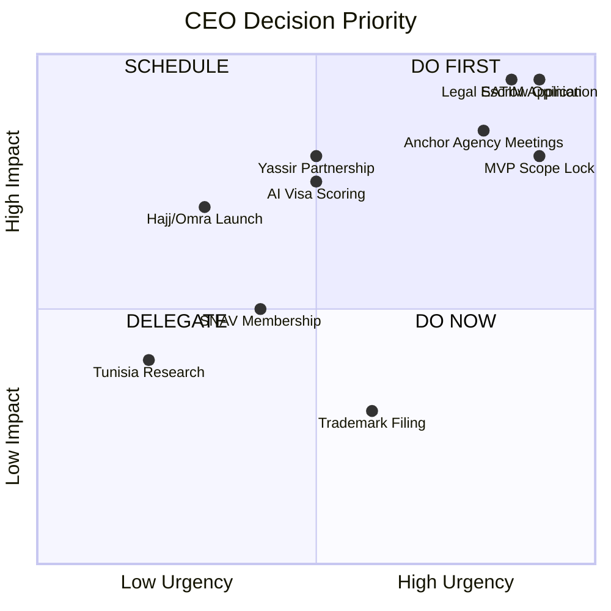

# MISSION 007 — Appendix: CEO Brief
## First 100 Decisions — Ordered and Justified

**Context:** You are CEO of Safar (سفر) — Algeria's Travel Trust Layer. Day 1. Capital: assumed seed round closed. Team: 8 people. This is your decision sequence.

---

## Week 1: Foundation (Decisions 1–15)

| # | Decision | Justification |
|---|----------|---------------|
| 1 | **Incorporate Algerian entity (SARL/EURL) immediately** | Law 18-05 requires CNRC registration before any commercial activity. Cannot operate in gray area. |
| 2 | **Register CNRC activity code 607.074 (e-commerce)** | Legal prerequisite for online payments and travel sales. |
| 3 | **Hire Algerian legal counsel specializing in BA + MTA regulation** | Escrow model legality (R004) is existential — need opinion before building. |
| 4 | **Appoint interim CTO with fintech + payments experience** | SATIM integration is the critical path; not a generic web developer. |
| 5 | **Open business bank account at BNA or BEA (public bank)** | SATIM merchant accounts typically require established banking relationship. |
| 6 | **Apply for SATIM merchant account / terminal ID** | 4–8 week lead time (Berkati guide). Start immediately — blocks all revenue. |
| 7 | **Select .dz hosting provider with SLA ≥99.5%** | Law 18-05 hosting requirement; non-negotiable. |
| 8 | **Define company values document (5 principles from Section 10)** | Culture anchor before first hire beyond founders. |
| 9 | **Sign NDA + advisory agreement with 1 SNAV-connected industry veteran** | Institutional knowledge; agency intros; credibility. |
| 10 | **Create decision log template (all FACT/INTERPRETATION/HYPOTHESIS labeled)** | Maintain evidence discipline from Mission 007 methodology. |
| 11 | **Establish separate client money account (if legally permitted)** | Escrow architecture depends on this — parallel to SATIM application. |
| 12 | **Purchase professional liability insurance** | Loi 99-06 requires for agencies; prudent for platform even as intermediary. |
| 13 | **Register domain safar.dz + safar.travel** | Brand protection; .dz for compliance, .travel for diaspora. |
| 14 | **Set up GitHub org with security policies (branch protection, 2FA)** | Cyber risk R085-R088 — security from Day 1. |
| 15 | **Write data retention policy (passport docs: 30 days post-travel max)** | Loi 18-07 compliance; minimize breach impact. |

## Week 2: Product Definition (Decisions 16–30)

| # | Decision | Justification |
|---|----------|---------------|
| 16 | **MVP scope: Agency verification + escrow + complaint — NOT flight search** | Mission 005/006/007 consensus: trust > aggregation. |
| 17 | **Target segment: Algeria→France family travel first** | Largest Schengen volume; highest pain; diaspora connection. |
| 18 | **Language priority: French > Arabic > Darija** | France corridor; formal docs in French. |
| 19 | **Mobile-first (React Native) with responsive web** | 84.2% research on mobile (Mission 006); agencies use WhatsApp. |
| 20 | **Design family dashboard (multi-traveler, multi-role)** | Algerian travel is family-scale decision unit, not individual. |
| 21 | **Define agency tier system (T1: MTA verified → T4: community)** | Trust model from Section 10; gives agencies upgrade path. |
| 22 | **Commit: never use "visa guaranteed" in any marketing** | R063 — single biggest reputation risk. |
| 23 | **Build wireframes for 5 core flows: verify agency, escrow pay, track journey, file complaint, visa checklist** | Scope control; no feature creep. |
| 24 | **Select WhatsApp Business API provider (e.g., 360dialog)** | Meet users where they are; logged support. |
| 25 | **Define escrow milestone percentages: 10/40/30/20** | Section 10 payment model; balances agency cash flow vs protection. |
| 26 | **Create visa dossier checklist for France (Schengen type C)** | First AI feature; highest demand destination. |
| 27 | **Decide: no passport storage — upload, process, delete** | R037 mitigation; process in memory where possible. |
| 28 | **Establish design system (colors, typography, trust badges)** | Consistency; professional appearance vs scam sites. |
| 29 | **Write API specification for agency partner integration v0.1** | Even if manual at first, define the interface. |
| 30 | **Kill any existing flight search prototype** | Focus discipline; flight search is not the moat. |

## Week 3: Partnerships (Decisions 31–45)

| # | Decision | Justification |
|---|----------|---------------|
| 31 | **Identify 20 anchor agencies in Algiers, Oran, Constantine** | Geographic coverage; 80% of outbound volume. |
| 32 | **Prioritize agencies with IATA accreditation for anchor set** | BSP ticketing capability; higher quality signal. |
| 33 | **Schedule 10 agency discovery meetings (in person)** | Trust is built face-to-face in Algeria; no cold email. |
| 34 | **Prepare agency value proposition deck (customers, not displacement)** | R028 mitigation — agencies fear disintermediation. |
| 35 | **Offer anchor agencies: 0% platform fee for first 6 months** | Supply acquisition; prove value before monetizing. |
| 36 | **Contact Chargily for SATIM abstraction layer** | Faster integration than raw SATIM (R032); fallback path. |
| 37 | **Request meeting with MTA Direction des Agences** | Long-term license API; introduce as compliance partner. |
| 38 | **Contact travel insurance provider (e.g., CAAR, GAM)** | Revenue stream; risk mitigation for travelers. |
| 39 | **Explore Amadeus for Startups or partner program** | GDS access path without full IATA accreditation. |
| 40 | **Identify host agency for BSP ticketing (if needed)** | R008 mitigation; don't wait for own IATA. |
| 41 | **Reach out to 3 diaspora Facebook group admins** | Distribution channel; community trust. |
| 42 | **Decline any meeting with informal visa brokers** | R007 — no association with illegal intermediation. |
| 43 | **Evaluate Yassir partnership vs competition** | R120 — better to partner early than fight later. |
| 44 | **Join SNAV as associate/observer member** | R045 mitigation; industry legitimacy. |
| 45 | **Apply to Banque d'Algérie regulatory sandbox (if open)** | R049 — escrow legality path; first-mover advantage. |

## Week 4: Build (Decisions 46–60)

| # | Decision | Justification |
|---|----------|---------------|
| 46 | **Deploy staging environment on .dz hosting** | Test SATIM integration in compliant environment. |
| 47 | **Implement SATIM register/confirm/refund flow** | Core payment path; use open-source satim-php as reference. |
| 48 | **Build agency verification module (manual MTA check initially)** | MVP without API; ops team verifies license numbers. |
| 49 | **Build escrow state machine (5 states: pending, held, partial, released, disputed)** | Core product; must be bulletproof. |
| 50 | **Implement dispute workflow with 72-hour SLA** | Section 10 trust model; differentiate from cash payments. |
| 51 | **Build complaint submission form with evidence upload** | Start complaint database — future moat data. |
| 52 | **Integrate WhatsApp notification for payment confirmations** | User expectation; family members need alerts. |
| 53 | **Create admin panel for ops team (agency verify, dispute resolve)** | Internal tooling before consumer polish. |
| 54 | **Implement audit log for all financial transactions** | R054 AML compliance; dispute evidence. |
| 55 | **Build France visa dossier checklist (static, no AI yet)** | Quick value; test engagement before AI investment. |
| 56 | **Set up Sentry + logging infrastructure** | R039 — payment webhook failures must be caught instantly. |
| 57 | **Implement rate limiting and WAF on public endpoints** | R081 DDoS protection before launch. |
| 58 | **Create automated SATIM reconciliation job (nightly)** | Financial integrity; catch webhook failures. |
| 59 | **Build agency onboarding flow (document upload, tier assignment)** | Supply side of marketplace. |
| 60 | **Write Terms of Service with clear intermediary role language** | R101 — platform is not the travel organizer. |

## Month 2: Compliance & Testing (Decisions 61–75)

| # | Decision | Justification |
|---|----------|---------------|
| 61 | **Receive legal opinion on escrow model** | Go/no-go on core product architecture. |
| 62 | **If escrow blocked: pivot to "verified pay" (SATIM with delivery confirmation)** | Fallback that still adds trust vs raw cash. |
| 63 | **Complete SATIM production certification** | Cannot launch without live payments. |
| 64 | **Conduct penetration test on staging** | R082-R084 — before handling real passport data. |
| 65 | **Run closed beta with 3 anchor agencies + 30 travelers** | Real transaction testing; ops process validation. |
| 66 | **Process minimum 50 escrow transactions in beta** | Prove payment flow; build complaint baseline. |
| 67 | **Measure agency NPS and traveler NPS separately** | Two-sided marketplace health metrics. |
| 68 | **Document all beta failures in postmortem format** | Learning culture; risk register updates. |
| 69 | **Train ops team on MTA license verification procedure** | Standardize before scale. |
| 70 | **Establish KYC threshold: escrow >50,000 DZD requires ID verification** | R054 AML mitigation. |
| 71 | **Create crisis communication plan (fraud, breach, airline collapse)** | R061-R062 — prepare before needed. |
| 72 | **File trademark for Safar brand in Algeria** | IP protection. |
| 73 | **Review and update risk register with beta learnings** | Living document; R001-R120. |
| 74 | **Hire customer support lead (trilingual)** | R027 — cannot scale support on founders. |
| 75 | **Establish banking relationship manager cadence (monthly)** | SATIM issues require bank escalation path. |

## Month 3: Launch (Decisions 76–90)

| # | Decision | Justification |
|---|----------|---------------|
| 76 | **Soft launch in Algiers only** | Geographic focus; ops capacity constraint. |
| 77 | **Launch with 10 verified agencies minimum** | Supply sufficiency for France corridor. |
| 78 | **Marketing: Facebook group posts (not paid ads initially)** | Community trust; R114 compliance. |
| 79 | **Publish first "Agency Transparency Report" (anonymized complaint stats)** | Thought leadership; trust building. |
| 80 | **Enable visa dossier AI (v1: document completeness only)** | No rejection prediction yet — R035 caution. |
| 81 | **Launch referral program: 500 DZD credit for family referrals** | Network effects; low CAC. |
| 82 | **Set public SLA: escrow disputes resolved in 72 hours** | Competitive differentiation. |
| 83 | **Create content series: "True Cost of Travel to France"** | FX education; SEO; trust building. |
| 84 | **Monitor Capago slot availability (manual scraping initially)** | Visa intelligence v0; high demand feature. |
| 85 | **Do NOT launch Hajj/Omra until ONPO partnership** | R048 — too regulated for MVP. |
| 86 | **Establish weekly metrics review (GMV, escrow volume, dispute rate, NPS)** | Data-driven operations from Day 1. |
| 87 | **Cap monthly escrow volume at 10M DZD initially** | R105 — limit refund liability exposure during launch. |
| 88 | **Create agency performance leaderboard (private, not public shaming)** | Incentivize quality without R053 manipulation. |
| 89 | **Launch diaspora landing page (French language, EUR display)** | Second acquisition channel. |
| 90 | **Publish launch blog post with FACT/INTERPRETATION transparency** | Brand differentiation; media interest. |

## Month 4–6: Scale Foundations (Decisions 91–100)

| # | Decision | Justification |
|---|----------|---------------|
| 91 | **Expand to Oran and Constantine** | Second-tier cities; visa center presence. |
| 92 | **Begin MTA formal data-sharing MoU negotiation** | Section 9 Phase 2; license API is the moat. |
| 93 | **Hire Head of Agency Partnerships (industry insider)** | Scale supply side beyond founder relationships. |
| 94 | **Launch agency SaaS tier (paid: CRM + escrow + badge)** | Revenue diversification; R017 seasonality mitigation. |
| 95 | **Integrate travel insurance at checkout** | Revenue stream; risk reduction for travelers. |
| 96 | **Begin visa dossier AI v2 (rejection risk scoring with disclaimers)** | R035 — only after 500+ outcome data points. |
| 97 | **Evaluate Series A readiness metrics (GMV, retention, dispute rate)** | R019 — funding for scale or bootstrap decision. |
| 98 | **Initiate Tunisia market research (regulatory mapping)** | Section 10 expansion path; year 2 planning. |
| 99 | **Propose MTA "Verified Digital Agency" certification program** | Regulatory capture as partnership, not opposition. |
| 100 | **Board meeting: review all 100 decisions, update next 100** | Continuous strategic discipline; Mission 007 living document. |

---

## Decision Priority Matrix

## The Three Decisions That Matter Most

If you can only make three decisions tomorrow:

1. **#6 — Apply for SATIM merchant account.** Without payments, there is no company.
2. **#3 — Hire BA/MTA legal counsel.** Without escrow legality, there is no differentiation.
3. **#33 — Schedule 10 agency meetings in person.** Without supply, there is no marketplace.

Everything else is execution.

---

**End of CEO Brief**
