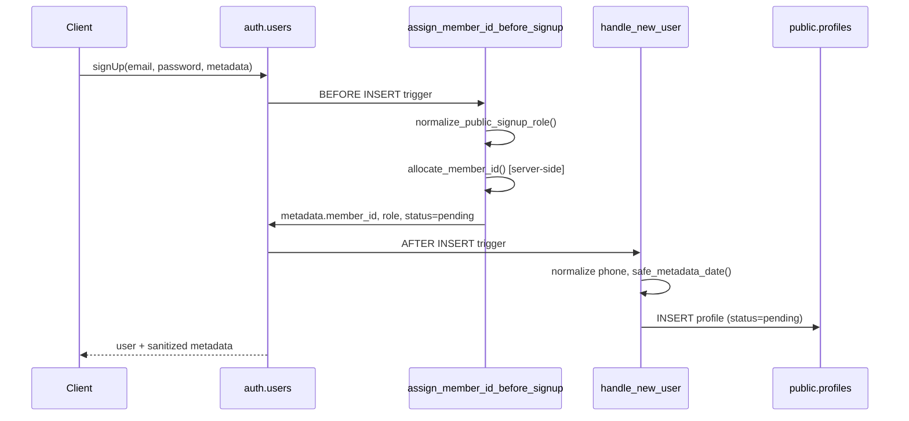
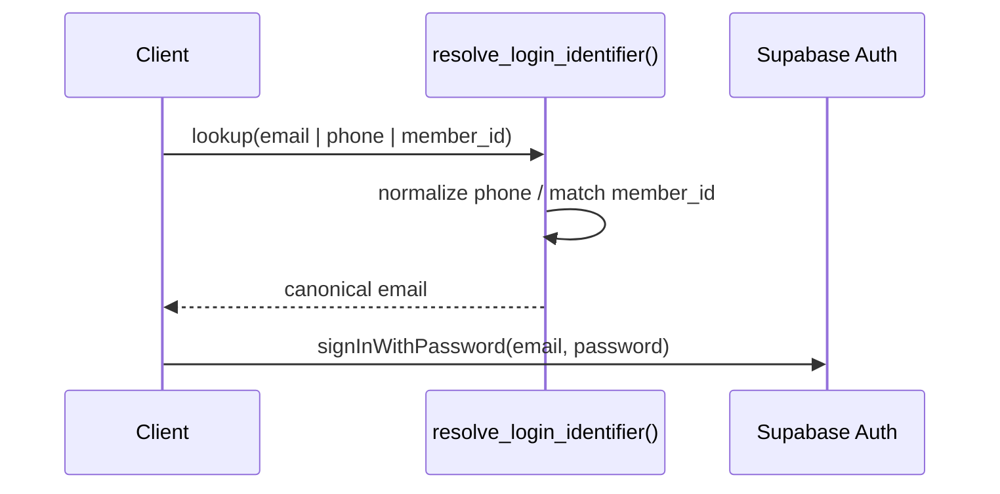

# Phase 0 Database Architecture

**Version:** Phase 0 Final · `20260720_phase0_final.sql`  
**Status:** Production baseline (frozen — no new features)

This document describes the canonical Phase 0 database layer for MawashiDZ.

---

## Overview

Phase 0 establishes:

- User profiles linked to Supabase Auth (`auth.users`)
- Server-side `member_id` allocation (no client control)
- Signup and login identifier resolution
- Row Level Security (RLS) for public-facing tables
- Idempotent, re-runnable migration

Phase 0 explicitly excludes: RBAC, QR codes, verification workflows, dashboards (Phase 1+).

---

## Tables

### `public.profiles`

Primary user profile table. One row per `auth.users` record.

| Column | Type | Notes |
|--------|------|-------|
| `id` | `uuid` PK | FK → `auth.users(id)` ON DELETE CASCADE |
| `member_id` | `text` | Unique when set. Format: `MDZ-{prefix}-{6 digits}` |
| `registration_id` | `text` | Optional external reference |
| `full_name`, `first_name`, `last_name` | `text` | From signup metadata |
| `phone` | `text` | Normalized to `+2135/6/7XXXXXXXX` |
| `email` | `text` | Mirrors auth email |
| `role` | `text` | Whitelisted: `buyer`, `breeder`, `vet`, `feed` |
| `wilaya`, `daira`, `commune` | `text` | Location fields |
| `birth_date` | `date` | Parsed via `safe_metadata_date()` |
| `invite_code`, `invited_by` | `text` | Referral metadata |
| `status` | `text` NOT NULL | Always `pending` at signup (server-enforced) |
| `created_at` | `timestamptz` | Default `now()` |

**Indexes:** unique partial on `member_id`; indexes on `phone`, `lower(email)`.

### `public.member_id_counters`

Internal sequence table for concurrency-safe ID allocation.

| Column | Type | Notes |
|--------|------|-------|
| `prefix` | `text` PK | Single-letter role prefix (`F`, `V`, `S`, `U`, …) |
| `last_value` | `bigint` | Last allocated sequence number |

**Access:** RLS enabled. No grants to `anon` or `authenticated`. Only touched by `allocate_member_id()` (SECURITY DEFINER).

### `public.registrations`

Pre-auth founding-member registration form submissions.

- RLS: public INSERT only (`anon`, `authenticated`)
- No SELECT/UPDATE for clients

### `public.contact_messages`

Contact form submissions.

- RLS: public INSERT only

### `public.feedback_tickets`

Feedback / report submissions.

- RLS: public INSERT only

---

## Relationships

```
auth.users (1) ──< (1) public.profiles
                      │
                      └── member_id → member_id_counters (logical, via prefix)
```

- Profile creation is automatic via trigger on `auth.users` INSERT.
- `member_id` is allocated before and after signup (defense in depth).

---

## Functions

### Canonical Phase 0 functions (7)

| Function | Type | Purpose |
|----------|------|---------|
| `normalize_public_signup_role(text)` | IMMUTABLE | Whitelist roles; unknown → `buyer` |
| `safe_metadata_date(text)` | IMMUTABLE | Safe `YYYY-MM-DD` parse; invalid → NULL |
| `normalize_algerian_phone(text)` | IMMUTABLE | Normalize to `+213…` mobile format |
| `allocate_member_id(text)` | SECURITY DEFINER | Sequential ID allocation |
| `assign_member_id_before_signup()` | SECURITY DEFINER trigger | BEFORE INSERT on `auth.users` |
| `handle_new_user()` | SECURITY DEFINER trigger | AFTER INSERT on `auth.users` |
| `resolve_login_identifier(text)` | SECURITY DEFINER | Email / phone / member_id → email |

### Supporting functions

| Function | Purpose |
|----------|---------|
| `mdz_role_prefix(text)` | Maps role → single-letter prefix |
| `sync_member_id_counters_from_profiles()` | Reconcile counters from existing IDs (migration/backfill) |

### Role → prefix mapping

| Role | Prefix | Example ID |
|------|--------|------------|
| `breeder` | F | `MDZ-F-000001` |
| `vet` | V | `MDZ-V-000001` |
| `feed` | S | `MDZ-S-000001` |
| `buyer` | U | `MDZ-U-000001` |

Privileged UI roles (`manager`, `ambassador`, `partner`, `admin`, …) are **downgraded to `buyer`** at signup.

---

## SECURITY DEFINER Functions

All SECURITY DEFINER functions use `set search_path = public` to prevent search-path hijacking.

| Function | EXECUTE granted to |
|----------|-------------------|
| `allocate_member_id` | `service_role` only |
| `sync_member_id_counters_from_profiles` | `service_role` only |
| `resolve_login_identifier` | `anon`, `authenticated`, `service_role` |
| `assign_member_id_before_signup` | (trigger only — no direct EXECUTE) |
| `handle_new_user` | (trigger only — no direct EXECUTE) |

**Critical:** `allocate_member_id()` is **not** callable by `anon` or `authenticated`. Allocation happens only inside triggers running as SECURITY DEFINER.

---

## Triggers

Exactly **one active trigger per purpose** on `auth.users`:

| Trigger | Timing | Function | Purpose |
|---------|--------|----------|---------|
| `on_auth_user_assign_member_id` | BEFORE INSERT | `assign_member_id_before_signup()` | Overwrite client `member_id`, `role`, `status` in metadata |
| `on_auth_user_created` | AFTER INSERT | `handle_new_user()` | Create/update `profiles` row |

---

## RLS Policies

### `profiles`

| Policy | Operation | Role | Rule |
|--------|-----------|------|------|
| `profiles: self read` | SELECT | `authenticated` | `id = auth.uid()` |

No INSERT, UPDATE, or DELETE policies for clients. Profile rows are created by `handle_new_user()` trigger (bypasses RLS as SECURITY DEFINER).

### `registrations`, `contact_messages`, `feedback_tickets`

| Policy | Operation | Roles |
|--------|-----------|-------|
| `*: public insert` | INSERT | `anon`, `authenticated` |

No client read access.

### `member_id_counters`

RLS enabled. No policies → no client access.

---

## Signup Flow



**Trust boundary:** Client metadata is untrusted. Server overwrites `member_id`, `role`, and `status`.

---

## Login Flow



The frontend calls `resolve_login_identifier` before `signInWithPassword` when the user enters a phone number or member ID.

---

## member_id Flow

1. User selects role at signup (UI may show privileged tabs; server downgrades unknown roles).
2. `assign_member_id_before_signup()` runs BEFORE INSERT:
   - Normalizes role via whitelist
   - Calls `allocate_member_id(normalized_role)`
   - Writes `member_id`, `role`, `status=pending` into `raw_user_meta_data`
3. `handle_new_user()` runs AFTER INSERT:
   - Reads `member_id` from metadata (already server-assigned)
   - Falls back to `allocate_member_id()` only if missing/invalid
   - Inserts profile with hardcoded `status = 'pending'`

---

## Sequence Allocation Flow

```
allocate_member_id(role)
  → normalize_public_signup_role(role)
  → mdz_role_prefix(role) → e.g. "F"
  → pg_advisory_xact_lock(hashtext('mdz_member_id_F'))
  → UPSERT member_id_counters SET last_value = last_value + 1
  → RETURN 'MDZ-F-' || lpad(next_value, 6, '0')
```

Concurrency: advisory transaction lock per prefix + atomic UPSERT ensures no duplicate IDs under parallel signups.

---

## Security Model

### Principles

1. **No client-controlled identity fields** — `member_id` and `status` are server-assigned.
2. **Role whitelist** — only `buyer`, `breeder`, `vet`, `feed`; all others → `buyer`.
3. **Least privilege** — `allocate_member_id` restricted to `service_role`; triggers run as SECURITY DEFINER.
4. **Fixed search_path** — all SECURITY DEFINER functions set `search_path = public`.
5. **RLS isolation** — users read only their own profile; counters table inaccessible to clients.
6. **No profile self-update** — no UPDATE policy on `profiles` prevents role/status escalation.

### Trust Boundaries

| Zone | Trust level | Controls |
|------|-------------|----------|
| Browser / client | Untrusted | Metadata sanitized by triggers |
| `anon` / `authenticated` | Limited | RLS + revoked EXECUTE on sensitive functions |
| `service_role` | Trusted (server only) | Can call `allocate_member_id` directly |
| Database triggers | Trusted | SECURITY DEFINER, fixed search_path |

---

## Migration

**Canonical file:** `supabase/migrations/20260720_phase0_final.sql`

- Idempotent (safe to re-run)
- Merges all prior Phase 0 migrations
- Backfills missing `member_id` on legacy profiles
- Syncs `member_id_counters` from existing data
- Archived migrations: `supabase/migrations/archive/`

---

## Phase 1+ Gaps (intentionally deferred)

- Admin verification workflow for `breeder` / `vet` / `feed`
- Role-based authorization (RBAC)
- Profile UPDATE policies for verified users
- QR code generation
- Dashboards and analytics

---

*Phase 0 Final — awaiting owner approval before production deployment.*
