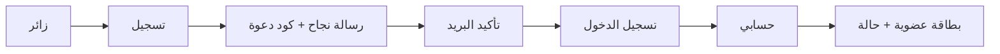

# User Interface & User Experience Status (UI/UX)

**المنصة:** MawashiDZ — https://mawashidz.com  
**تاريخ التقرير:** 2026-07-20  
**الإصدار الحي:** v1.9.2 (عند آخر فحص)  
**خط الأساس للمقارنة:** v1.7.1 (`5d2a0ac`) → v1.9.0 (استرجاع الإنتاج) → v1.9.2 (الحالي)

> هذا التقرير يكمّل التقارير التقنية (Git، Worker، Supabase، النشر) ويوثّق **التطور البصري والوظيفي** الذي يراه المستخدم النهائي — دون وصفه بأنه «مثالي».

---

## 1. ملخص تنفيذي

منذ الإصدار السابق المعروف في Git (`v1.7.1`)، شهدت الواجهة قفزة واضحة في **تجربة العضو**: تسجيل، دخول، تأكيد بريد، حسابي، وبطاقة العضوية. التدفق الكامل **تسجيل → تأكيد البريد → دخول → حسابي** أصبح يعمل عمليًا (مع تحفظات Rate Limit على اختبار Signup الحقيقي).

ما زال **Dashboard العضو الكامل** و**لوحة الإدارة** غير مكتملين — وهذا مقصود وموثّق كـ «قيد التطوير» وليس حذفًا للميزات.

---

## 2. ما أُضيف في الواجهة منذ الإصدار السابق

### مقارنة الإصدارات

| المرحلة | الإصدار | أبرز إضافات الواجهة |
|---------|---------|---------------------|
| خط الأساس (Git main سابقًا) | **v1.7.1** | تسجيل/دخول أساسي، بطاقة عضو مبسطة داخل «حسابي»، بدون Phase 1 Auth UI |
| استرجاع الإنتاج | **v1.9.0** | Phase 1 Auth UI، `updateAuthChrome()`، هيدر ديناميكي، نجاح تسجيل محسّن، `is-success` modal |
| دمج Registration Flow | **v1.9.0 + pipeline** | `registration-flow.mjs`، حماية double-submit، رسائل تعارض آمنة |
| تحسينات ما بعد النشر | **v1.9.2** | i18n أوسع، تبديل Hero/Dock إلى «حسابي» بعد الدخول، تحسين `auth-callback` وPKCE |

### قائمة الإضافات التي لاحظها الفريق (موثّقة ✅)

| # | العنصر | الحالة | ملاحظة |
|---|--------|--------|--------|
| 1 | زر **حسابي** بعد تسجيل الدخول | ✅ يعمل | يظهر في الهيدر/القائمة/الـ Hero حسب حالة الجلسة (`updateAuthChrome`) |
| 2 | زر **تسجيل الخروج** في الهيدر | ✅ يعمل | يظهر عند وجود جلسة (`headerLogoutBtn` + قائمة جانبية) |
| 3 | **بطاقة العضوية** داخل «حسابي» | ✅ جيدة | `member-hero` + تدرج لوني + شارة MDZ |
| 4 | عرض **رقم العضوية** | ✅ يعمل | `member-id-chip` + حقل في شبكة البيانات |
| 5 | عرض **رقم الطلب** | ✅ يعمل | `registration_id` في صفحة الحساب |
| 6 | عرض **حالة الحساب** (قيد المراجعة…) | ✅ يعمل | `member-status-pill` + `statusLabelArabic()` |
| 7 | **كود الدعوة** الشخصي + نسخ | ✅ يعمل | `invite-panel` + `#copyInviteCode` |
| 8 | **رسالة نجاح التسجيل** | ✅ جيدة | `premium-success` + `is-success` يخفي النموذج بعد النجاح |
| 9 | **زر «فتح حسابي»** بعد التسجيل (عند وجود جلسة) | ✅ يعمل | `#openAccountAfterSignup` |
| 10 | **Responsive Mobile** | ✅ جيد | قائمة ☰، حقول هاتف جزائرية، نماذج قابلة للتمرير |
| 11 | تدفق **تأكيد البريد → دخول → حسابي** | ✅ محسّن | `handleAuthRedirect` + PKCE + توجيه لنافذة الدخول عند الحاجة (v1.9.2) |

---

## 3. جدول التقييم العام (حسب طلب الفريق)

| العنصر | الحالة | التقييم المختصر |
|--------|--------|-----------------|
| Responsive Mobile | ✅ جيد | القائمة الجانبية والنماذج صالحة للاستخدام اليومي |
| تجربة التسجيل | ✅ جيدة | نموذج متعدد الأدوار + نجاح بصري واضح |
| تجربة الدخول | ✅ جيدة | حالات خطأ عربية + استرجاع كلمة المرور |
| صفحة حسابي | ✅ جيدة | بطاقة عضو + بيانات أساسية — ليست Dashboard كاملة |
| Hero Section | 🟡 تحتاج تحسين بصري | محتوى قوي لكن التباين والكثافة تحتاج صقلًا |
| Header | 🟡 يحتاج تنظيم أكثر | ازدواجية بين هيدر/قائمة/ـ dock في بعض الشاشات |
| Footer | 🟡 يحتاج تطوير | روابط placeholder لبعض السياسات |
| Dashboard (عضو) | ⏳ غير مكتمل | لا توجد لوحة نشاط/إحصائيات/طلبات بعد |
| لوحة الإدارة | ⏳ غير مكتملة | غير منشورة في الواجهة العامة |

---

## 4. تقييم كل صفحة / شاشة (من 10)

| الصفحة / الشاشة | قبل (v1.7.1) | الآن (v1.9.2) | ما يعمل | ما يحتاج تحسين |
|-----------------|-------------|---------------|---------|----------------|
| **الصفحة الرئيسية** | 6/10 | 7.5/10 | Hero، أقسام المحتوى، CTA | كثافة بصرية، توحيد CTA |
| **القائمة الجانبية (جوال)** | 5/10 | 8/10 | فتح/إغلاق، روابط حسابي/تسجيل | ترتيب العناصر عند تسجيل الدخول |
| **تسجيل الدخول** | 6/10 | 8/10 | نموذج، أخطاء عربية، نسيت كلمة المرور | توضيح post-confirm للمستخدم الجديد |
| **التسجيل** | 6/10 | 8.5/10 | أدوار، هاتف DZ، عداد كلمة مرور، نجاح | تقليل طول النموذج على الجوال |
| **نجاح التسجيل (Modal)** | 4/10 | 9/10 | بطاقة premium، كود دعوة، رقم طلب | تحذيرات الجزئي (`success-warn`) نادرة |
| **حسابي** | 5/10 | 8/10 | بطاقة عضو، حالة، رقم عضوية/طلب | لا تعديل ملف، لا سجل نشاط |
| **التواصل** | 7/10 | 7/10 | نموذج + تحقق هاتف | ربط حالة التذكرة للمستخدم |
| **Footer / سياسات** | 5/10 | 5/10 | روابط موجودة | صفحات حقيقية بدل toast |
| **Dashboard عضو** | — | 2/10 | — | غير مبني بعد |
| **لوحة الإدارة** | — | 0/10 | — | مخطط لاحقًا — **لم يُحذف شيء** |

**المتوسط التقريبي للواجهة المنشورة:** **7.2 / 10** — منتج قابل للاستخدام، ليس «مثاليًا».

---

## 5. لقطات الشاشة (بعد / قبل)

### المسار
`docs/screenshots/ui-ux-v192/`

| الملف | الوصف |
|-------|--------|
| `desktop/00-before-v171-home.png` | **قبل** — الصفحة الرئيسية v1.7.1 |
| `desktop/00-before-v171-login.png` | **قبل** — نافذة الدخول v1.7.1 |
| `desktop/01-home.png` | **بعد** — الرئيسية v1.9.2 (سطح مكتب) |
| `desktop/02-drawer.png` | **بعد** — القائمة الجانبية |
| `desktop/03-login.png` | **بعد** — نافذة الدخول |
| `desktop/04-register.png` | **بعد** — نافذة التسجيل |
| `mobile/01-home.png` | **بعد** — الرئيسية (جوال) |
| `mobile/02-drawer.png` | **بعد** — القائمة (جوال) |
| `mobile/03-login.png` | **بعد** — الدخول (جوال) |
| `mobile/04-register.png` | **بعد** — التسجيل (جوال) |

> لقطات «حسابي» و«نجاح التسجيل» تتطلب جلسة حقيقية — لم تُلتقط لتجنب Signup probes وRate Limit.

---

## 6. تدفق المستخدم (User Journey)

| الخطوة | الحالة | ملاحظة |
|--------|--------|--------|
| تسجيل | ✅ UI جاهزة | Pipeline مربوط؛ اختبار إنتاجي معلّق بسبب Rate Limit |
| تأكيد البريد | ✅ محسّن v1.9.2 | `auth-callback` + PKCE |
| دخول | ✅ يعمل | `authErrorArabic` |
| حسابي | ✅ يعمل | جلب `profiles` من Supabase |
| Dashboard / إدارة | ⏳ لاحقًا | **محفوظة كمتطلبات مستقبلية — لم تُزال من الخطة** |

---

## 7. ما يعمل اليوم (Functional UI)

- فتح/إغلاق النوافذ: تسجيل، دخول، حسابي، ملاحظات، قائمة جوال.
- تبديل أزرار الهيدر/Hero/Dock حسب الجلسة (`updateAuthChrome`).
- عرض بيانات العضو الأساسية بعد الدخول.
- نسخ كود الدعوة ومشاركة الرابط.
- إخفاء نموذج التسجيل بعد النجاح (`#registerModal.is-success`).
- تحسين قابلية القراءة في نجاح التسجيل (Phase 1 Auth UI — `#mdz-v19-phase1-auth-ui`).

---

## 8. ما يحتاج تحسين (ليس حذفًا)

| المنطقة | الملاحظة | الأولوية |
|---------|----------|----------|
| Hero | تباين، ارتفاع القسم، توحيد CTA | متوسطة |
| Header | تقليل تكرار «تسجيل/حسابي» بين الهيدر والـ dock | متوسطة |
| Footer | صفحات شروط/خصوصية حقيقية | منخفضة–متوسطة |
| حسابي | تعديل الملف، رفع وثائق، سجل الطلبات | عالية (مرحلة لاحقة) |
| `/api/livestock-news` | تحذير console — لا يعطل الواجهة | منخفضة |

---

## 9. ميزات محفوظة وغير مكتملة (لم تُحذف)

يُوثّق صراحةً أن التالي **مخطط له** ولم يُنفَّذ بعد في الواجهة العامة:

- **Dashboard العضو:** نشاط، طلبات، إشعارات، تفضيلات.
- **لوحة المدير العام:** مراجعة التسجيلات، إدارة الأعضاء، تقارير.
- **حسابات أعضاء متقدمة:** أدوار إضافية، صلاحيات، تفويض.

> لا يُنصح بحذف أي عنصر UI قائم انتظارًا لهذه المراحل. التحسينات المقبولة هي **التجميل والعصرنة** دون إزالة وظائف تعمل.

---

## 10. قائمة التحسينات المستقبلية (UI/UX Roadmap)

1. **Hero redesign** — صورة/فيديو خفيف، تباين WCAG AA، CTA واحد رئيسي.
2. **Header موحّد** — شريط واحد: شعار | تنقل | حسابي/خروج.
3. **صفحة حسابي v2** — تبويبات: الملف | الطلب | الدعوات | الأمان.
4. **حالة الطلب المرئية** — شريط تقدم (قيد المراجعة → مقبول).
5. **تسجيل مختصر على الجوال** — خطوات (wizard) بدل نموذج طويل.
6. **Dark mode اختياري** — حاليًا التصميم داكن جزئيًا وليس toggle.
7. **لوحة إدارة** — مرحلة منفصلة بعد استقرار تدفق العضو.

---

## 11. مراجع تقنية مرتبطة

| التقرير | المحتوى |
|---------|---------|
| `docs/PRODUCTION_DRIFT_REPORT.md` | فرق الإصدارات تقنيًا |
| `docs/REGISTRATION_FLOW_AUDIT.md` | Pipeline التسجيل |
| `docs/PRODUCTION_RECOVERY_MANIFEST.md` | استرجاع v1.9.0 |
| `docs/screenshots/ui-ux-v192/` | لقطات هذا التقرير |

---

## 12. الخلاصة

الواجهة تقدّمت من **واجهة تسويقية + نماذج** (v1.7.1) إلى **تجربة عضو أولية متماسكة** (v1.9.x): تسجيل، نجاح، دخول، حسابي. التقييم العادل: **جيد / قابل للاستخدام** — مع فجوات واضحة في Dashboard والإدارة والـ Hero/Footer، وهي **قيد التطوير** وليست أخطاء حذف.

**لا يُوصى بوصف الحالة بأنها «مثالية».**  
**يُوصى بوصفها: «أساس UI/UX ناجح للمرحلة الحالية — مع خارطة تحسين معلنة».**
