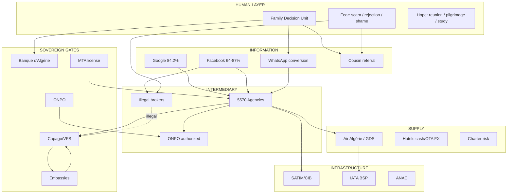
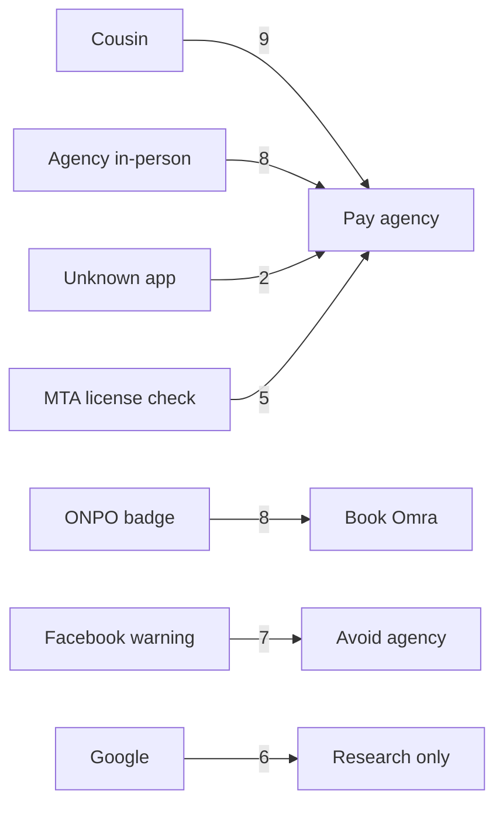

# 02 — MASTER KNOWLEDGE GRAPH
## Project Omega | Phase 2

Evidence base: Missions 005–010.

---

## Unified Knowledge Graph



---

## Influence Graph (Power 1–10)

| Actor | Power | Can Block | Can Accelerate |
|-------|-------|-----------|----------------|
| Banque d'Algérie | 10 | FX, payments | Allocation policy |
| Embassies | 10 | Visa | — |
| Air Algérie | 9 | Supply, distribution | — |
| MTA / ONPO | 9 | Licenses | Digitization |
| SATIM / banks | 9 | E-commerce payments | Merchant access |
| Capago | 8 | Appointment access | — |
| SNAV / agencies | 7 | Lobby, boycott | Customer referral |
| Yassir | 7 | Super-app bundle | Acquisition |
| Facebook/WhatsApp | 7 | Distribution, bans | Viral WOM |
| Travelers | 3 | — | Community warnings |

---

## Trust Graph



**FACT (M006):** Relational trust > institutional. **INTERPRETATION:** License verification alone insufficient (M005 #21).

---

## Money Graph

```
Traveler --cash/DZD--> Agency --float--> BSP --> Airline
Traveler --bank--> BA booth --EUR--> abroad spend
Traveler --SATIM--> Merchant (if legal e-com)
Traveler --black market--> FX parallel
Traveler --100k DZD--> illegal visa broker
Embassy --fee--> consulate
Capago --€29+--> service fee
```

**FACT (M007):** Agency holds pre-ticket float. **FACT (M005 #51):** OTA FX trap on hotels.

---

## Behavior Graph

```
Dream --> Google/Facebook --> Cousin consult --> Agency visit -->
WhatsApp negotiate --> PAYMENT (anxiety peak) --> Wait visa -->
Airport stress --> Travel --> Facebook post (loyalty/revenge)
```

**FACT (M006):** Anxiety peaks post-payment, not pre-booking.

---

## Regulation Graph

| Domain | Law/Body | Enforced? |
|--------|----------|-----------|
| Agency license | Loi 99-06 / MTA | Partially |
| E-commerce | Loi 18-05 | Weak (M007) |
| Payments | SATIM / BA | Strong |
| FX | BA Instruction 05-2025 | Strong |
| Visa | Consular sovereignty | Strong |
| Pilgrimage | ONPO | Strong |
| Passenger rights | Decree 16-175 / EU261 | Weak awareness |

---

## Technology Graph

| Layer | Maturity Algeria Travel |
|-------|-------------------------|
| GDS/BSP | High (air) |
| Agency CRM | Low |
| SATIM merchant | Medium friction |
| MTA public API | None |
| Embassy APIs | Closed |
| AI dossier | Greenfield |
| WhatsApp Business | Medium |

See `diagrams/` and `csv/knowledge_graph_edges.csv`.
