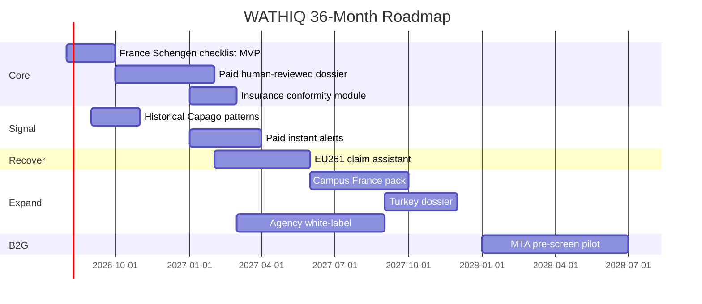

# 18 — PRODUCT ROADMAP

| Quarter | Milestone | Gate |
|---------|-----------|------|
| Q3 2026 | 100 paid dossiers | E001 pass |
| Q4 2026 | Signal 5k subs | No C&D |
| Q1 2027 | Recover €10k fees | Unit economics |
| Q2 2027 | 10 agency partners | E004 |
| Q4 2027 | 2000 paid dossiers | Hire reviewer #2 |
| 2028 | B2G pilot or profitable bootstrap | Founder choice |
